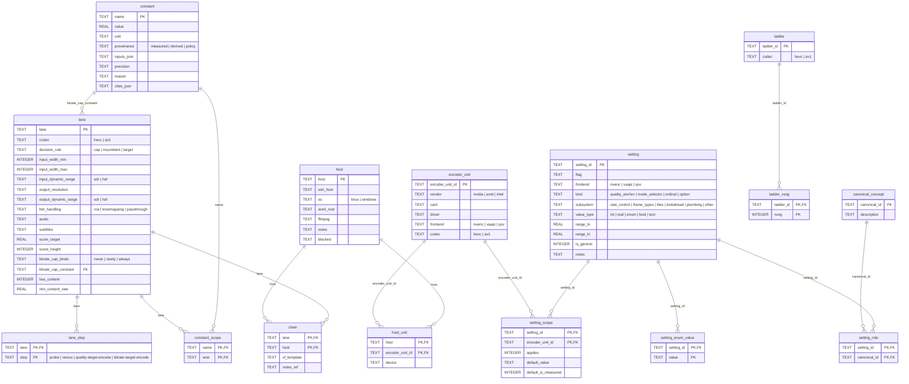
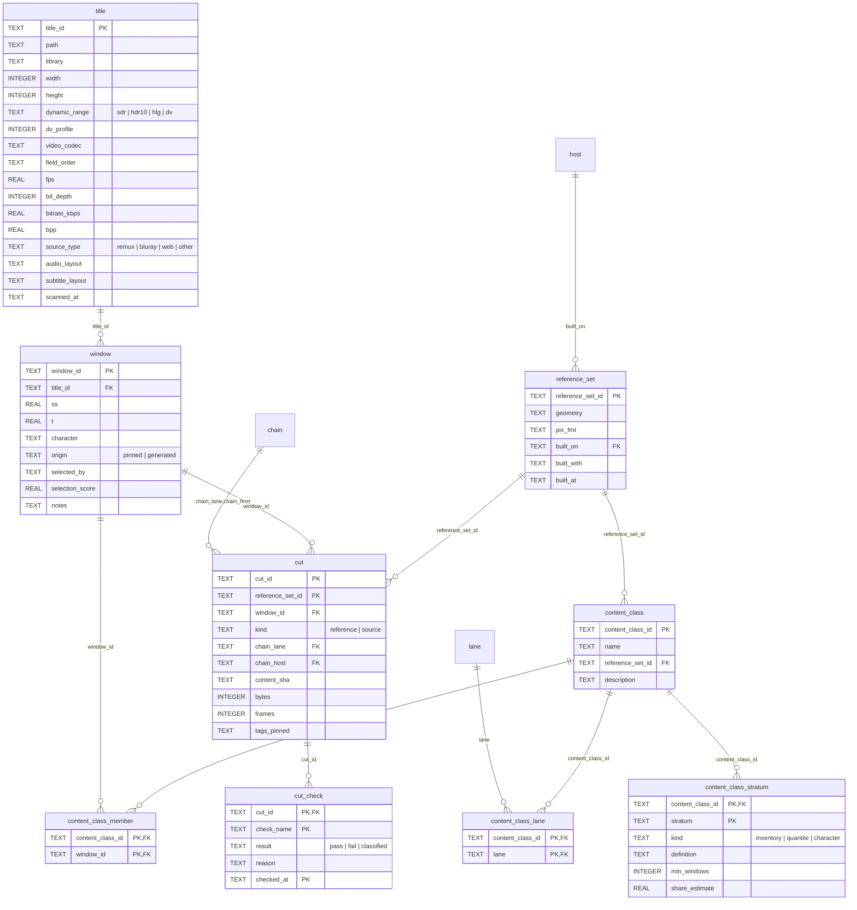
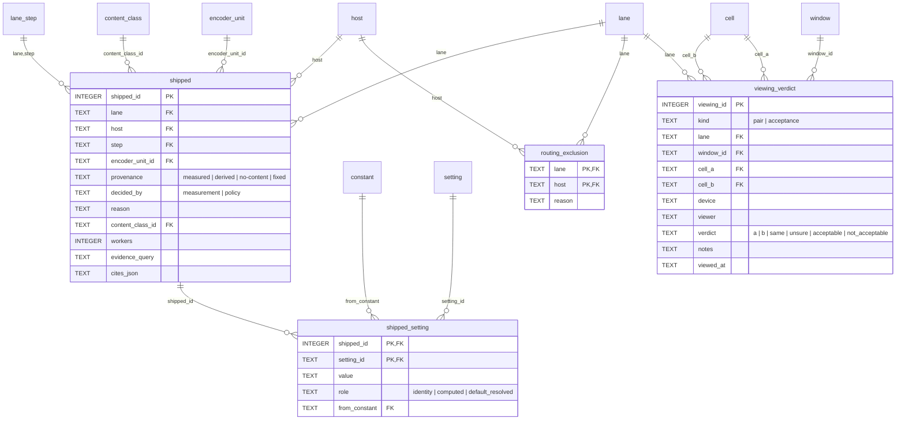

# The data model — the store is primary, the docs are renderings

**Phase 3 of `plans/greenfield-harness-rewrite.md`.**

⚠⚠ **THE CHANGE OF POSITION THAT SHAPES THIS DOCUMENT.** `TDARR-TRANSCODE-PLAN.md` is today
**hand-derived from a table buried in a 4,640-line RESULTS**, and then `doc_check` verifies after the
fact that its citations resolve. That is backwards. **Store the full results in a form that can
answer questions, and let the build order be one of the answers** — generated, not transcribed.

The schema is designed before the code because the current one was not: one producer wrote
`data/sweep-score/`'s **44** files with **six distinct headers**, the widest 50 columns holding six
unrelated entities, and `ms_ssim` is `0.0` in every one of the 2,999 rows that carry it.

---

## Terminology — one word, one meaning

Five words collided in this project before the model was written — *lane*, *axis*, *stage*, *gate*,
and *ladder* — and each cost a wrong conclusion. **One word per meaning, defined here, and the
schema's tables are named for them.** `SPEC.md` uses the same words.

| term | means | not | where |
|---|---|---|---|
| **lane** | what ships: one of Coverage's eight rows; the shipping key's first half | content · a staging label · a routing predicate | `lane` |
| **host** | a box; the shipping key's second half; **not** in the measurement key | a card | `host` |
| **flow step** | what a lane does to a title: `probe` · `remux` · `quality-target-encode` · `bitrate-target-encode` | a process stage · a scoring step | `lane_step.step` |
| **encoder unit** | `(vendor, card, driver, frontend, codec)`; the measurement key's hardware half | a host · a codec alone | `encoder_unit` |
| **content class** | a named, authored set of windows on one reference set; the measurement key's content half | a lane · a directory of cuts | `content_class` |
| **class serves a lane** | the class is sampled for the lane, and the lane's population is represented among its members | measured *on* the lane | `content_class_lane` |
| **title** | one library file; the population | a window | `title` |
| **window** | `(title, ss, t)`, pinned | a cut · a class | `window` |
| **cut** | one window's file in a reference set: the **reference cut** (lossless, through the chain) or the **source cut** (`-c copy`) | the window | `cut` |
| **reference set** | one class's cuts: one geometry, built once, identical on every node | a stage directory, the old word | `reference_set` |
| **frame** | how a class is picked: strata and quantiles over the population, each mapped to a window | the sample itself | `content_class_stratum` |
| **stratum** | one slice of the population — by an inventory factor, a quantile, or a character | | `content_class_stratum` |
| **character** | what a window is for — dark and noisy, film grain, CG, sustained motion…; judgement, written on the window | an inventory stratum | `window.character` |
| **setting** | an encoder option that can be set | an axis · a factor · a criterion | `setting` |
| **anchor** | the quality setting a ladder is placed on: `-qp`, `-cq`, `-q:v` | a target | `search.anchor_setting_id` |
| **factor** | a component of the measurement key: held constant or varied deliberately; the driver is one | a setting | the key |
| **criterion** | what a setting is judged on: **efficiency** (size and quality together, `bd_rate`) or **speed** | a setting · a target | Stage 9's output |
| **codec ladder** | the rungs a shipped value may take; per codec, never per host | the coarse or an arm ladder | `ladder_rung` |
| **coarse ladder** | the one ladder every arm shares in the locate pass, encode-only | the codec ladder | `search_coarse_rung` |
| **arm ladder** | one arm's rungs on one window, placed from the locate run for `bd_rate` overlap | the codec ladder | `arm_ladder_rung` |
| **rung** | one value of the anchor on a ladder | | |
| **search** | the spec of one measurement: class, unit, anchor, height, arms, targets | a run | `search` |
| **arm** | one candidate configuration: a set of identity settings | a cell | `arm`, `arm_setting` |
| **base arm** | the admissible mode with stock defaults at the encoder's default preset (B1), the preset ends standing candidates; the mandatory path encodes it on every rung of the codec ladder; every candidate is ranked against it; exactly one per search | the incumbent | `arm.role = base` |
| **candidate** | an arm the screen earned: a lever that moved bytes beyond the floor, with a mechanism; Stages 3, 4, 8 and 9 exist for candidates only | the base | `arm.role = candidate` |
| **shipping arm** | the arm Stage 10 inverts at: the base, unless a candidate beat it on efficiency and met the deadline | the base | `search.shipping_arm_id` |
| **incumbent arm** | what ships today, pinned at its anchor and scored on every member; the bar for an `incumbent` lane; names the viewing that accepted it | the base | `arm.role = incumbent`, `arm.anchor_value` |
| **run** | one invocation on one host, declaring its class, its search and its stage | a search | `run` |
| **cell** | one encode: run × window × cut kind, with its settings as rows | an arm | `cell`, `cell_setting` |
| **decision rule** | how a lane's value is chosen: `cap` · `incumbent` · `target` | a target | `lane.decision_rule` |
| **cap** | the device budget as a bitrate ceiling; a constant with a scope | headroom | `constant` CEILING |
| **headroom** | the fraction of CEILING requested as the rate in `bitrate-target-encode` so a whole title lands under it; measured from the full-length encode; 0.98 ships and overshoots | the cap · the skip threshold | `constant` HEADROOM |
| **skip threshold** | MARGIN: the saving the probe's encode must show over the source before encoding beats a remux; policy, bounded by the probe's precision | headroom | `constant` MARGIN |
| **chain** | the production filter graph per `(lane, host)`, authored before the sample; the reference cut is built through it, Stage 7 times it, Stage 11 ships it | the reference set | `chain` |
| **target** | an absolute score a `target` lane must hit, from an acceptance viewing | the incumbent's score · the cap | `search_target` |
| **panel height** | the device's 16:9 height, both dimensions forced even, where every score is read: 1250 kids, 1548 M4 (recipe G1) | the encode height | `lane.score_height` |
| **recipe** | a named, versioned procedure a row depends on — S1 scoring, K1 the key, W1 selection, T1 timing …; a changed recipe is a new name and a re-run | a build | `score.recipe`, `SPEC.md` |
| **stage** | one of the process's Stages 0–11 and 10b | a Phase of the plan · a directory · a scoring step | `run.stage` |
| **phase** | one of the rewrite plan's Phases 0–5 | a process stage | the plan |
| **scoring step** | one leg of Stage 6: rescale, ssimu2, butteraugli, libvmaf | a process stage | `step_trace.scoring_step` |
| **admissibility test** | Stage 1's refusals: opens · which mode · monotone · decodes · range · obeys a rate | a check · the viewing | Stage 1 |
| **screen** | Stage 1's per-setting, per-window verdict: honoured, inert, rejected… | the search | `setting_verdict` |
| **the viewing** | a person's verdict on the device: a **pair** (a against b) or an **acceptance** (for a lane's use); Stage 2's required input | a gate · a check · a test | `viewing_verdict` |
| **check** | an `x_*` view that must return zero rows | a test · a refusal in code | `schema.sql` |
| **refusal** | the harness declining to produce a number; an invariant with an incident behind it | ordinary validation | `refusals.json` |
| **provenance** | on a shipped value `measured` · `derived` · `no-content` · `fixed`, and `measured` needs the lane represented in the evidence class; on a constant `measured` (no typed value; a calibrate run) · `derived` (inputs and precision) · `policy` (a value and its reason) | `decided_by` | `shipped.provenance`, `constant.provenance` |
| **k of n** | a verdict over fewer windows than its class: labelled, never silent | | rank's output |
| **regime** | decode-bound or encode-bound, measured on THIS chain; never carried | | Stage 7 |
| **N\*** | the worker count past which throughput stops rising, per chain | | `timing.workers` |
| **content rate** | content minutes per wall minute for a `(lane, host)` at the shipped setting and N\*; the deadline read | fps | Stage 11's output |
| **throughput floor** | the content rate a host must reach for a lane; per lane, because the M4 lanes tolerate slower conversion; NULL reports only | | `lane.min_content_rate` |
| **host unit** | which units are in which box; routing reads it, the measurement key does not | | `host_unit` |
| **routing** | every host with a unit of the lane's codec gets a row per step, or an exclusion with a reason | policy | `shipped`, `routing_exclusion` |
| **fixed** | the provenance of a remux row: no encoder decision | derived | `shipped.provenance` |
| **run state** | one stored column, planned · launched · running · complete · failed · abandoned, with `run_event` as its log; a cell's state is derived from its rows | a log file | `run.state`, `run_event`, `v_cell_state` |
| **the plan** | a run's cells and their settings, written before launch; `count(cell)` is the expected count | a typed count | `cell`, `cell_setting` |
| **orchestrate** | the harness's launch, wait and fetch primitive; the one writer of `run`, `run_window`, `run_event`, `cell`, `cell_setting` | a stage | the writers list |
| **verb** | the one entry for an operator input: it validates and writes a FILE table; no file is edited by hand | a script | Phase 4 |
| **disposition** | what the new harness does about a refusal: by construction · a check · a process rule · judgement | | `refusals.json` |

**Retired words, and what replaced them:** *gate* → the viewing, an admissibility test, or
`check_config_axes` by name · *axis* → setting, anchor, criterion or factor · *leaf* → lane, or
reference set · *stage directory* → reference set · *flow × cell* → lane · *2a / 2b / skip* → the
flow steps · *baseline ladder* → the base arm on the codec ladder.

---

## ⚠⚠ THE KEY — what a result is ABOUT. This is the thing that keeps getting lost.

**Nothing else in this document matters if this is wrong.** Today there are **five partial keys and
they do not line up**, which is why a verdict keeps being carried somewhere it was never measured.

| vocabulary | where | values | what it actually names |
|---|---|---|---|
| **lane** | `tools/lane_axes.json` | `m4-1080p` · `m4-4k` · `standard` · `2d-animation` | **content** — its own note reads *"Native 1080p SDR live action on the m4 leaf"* |
| **flow × cell** | `scenarios.json` | 3 flows; cells `hdr`/`sdr`, and `{gt,le}1080p-{hdr,sdr}` | **a routing predicate** — what the Tdarr flow branches on |
| **leaf** | `Window`, `build_grid`'s `leaves` | `standard` · `2d-animation` · `m4` | **a staging label** — which stage directory the cut lives in |
| **content_class** | `searches/*.json` | `native-1080p-sdr` | **content again**, under a different name |
| **lane** | `runs/*.json` | `m4-1080p` on **all 26** | whatever `check_config_axes` wants |

**Where they break:**

- ⚠⚠ **`lane_axes.json`'s lane is CONTENT; `scenarios.json`'s cell is a ROUTING PREDICATE.** They are
  not the same thing and neither refines the other. `m4-1080p` covers `le1080p-sdr` but says nothing
  about `le1080p-hdr`, which is the **same resolution and the other setting set entirely**.
- ⚠⚠ **`leaf` has no resolution or dynamic-range split at all** — yet it is what a window carries and
  what the grid filters on. So what the *encode* is scoped by is coarser than what the
  *routing* is scoped by.
- ⚠⚠ **All 26 run descriptors declare `lane: m4-1080p`, including the B580 `av1_qsv` search.** Its
  measured list was built from **eta's `av1_nvenc`** and htpc-01's `hevc_vaapi`. The lane doc records
  this in as many words: *"the lane's `vaapi` is the 9070 XT's verdict and its `av1` is eta's
  `av1_nvenc`, both standing in for silicon that never measured them."*
- ⚠ **The key has been PATCHED, not defined.** `--vendor` was bolted onto `check_config_axes` on 2026-08-30
  precisely because lane was too coarse, giving `{value: ["<vendor>"|"<vendor>/<codec>"]}` — a
  scope-inside-a-scope. That is the shape of a missing primary key.

### ⚠ AND `axis` IS THE SECOND COLLISION — it means FOUR things

Exactly the same disease as `lane`, and it hides in the same way. **These are four different claims
and only one of them is about an encoder option:**

| "axis" as used today | means | the word to use |
|---|---|---|
| *"which axes the card honours"* · `PROBE_AXES` · `lane_axes.json` | an **encoder option** that can be swept | **setting** |
| *"ICQ rejected as the table's axis"* · *"shifted the quality axis +2.5"* | the ladder's **independent variable** | **quality anchor** (`setting.kind`) |
| *"SIZE AND QUALITY ARE ONE AXIS"* · *"speed is a separate axis"* | a **decision criterion** | **criterion** |
| *"the driver is an AXIS on this lane"* · *"content class is an axis"* | an experimental **variable to hold constant or vary deliberately** | **factor** — a component of the measurement key |

⚠⚠ **THE COLLISION IS NOT COSMETIC: *"the driver is an axis"* AND *"`-preset` is an axis"* ARE
DIFFERENT KINDS OF CLAIM.** One says a result is scoped and must be re-measured when it changes; the
other says a flag is worth screening. **Reading them as the same thing is how a screen verdict gets
carried into a lane conclusion**, which `RESULTS` §14a records happening three times with three
different figures for one flag, all of them correct at their own operating point.

✅ **Three of the four already have a home in the schema** — `setting`, `setting.kind =
quality_anchor`, and the `categorise` output. **The fourth, `factor`, is exactly the measurement key's
component list**, which is why naming it matters: a factor that is not in the key is a factor nobody
controlled for.
⚠ **The screen's output table is therefore `setting_verdict`, not `axis_verdict`** — and
`lane_axes.json` does not survive as a file at all: it is `setting_verdict` plus a policy.

### The two keys, and they are different

**A measurement and a shipped value are about different things.** Conflating them is a documented
failure in both directions.

    MEASUREMENT KEY   (content_class, encoder_unit, scoring_height)
      encoder_unit  =  (vendor, card, driver, frontend, codec)

    SHIPPING KEY      (lane, host, step)

**Every component of the measurement key is there because this campaign MEASURED it to matter:**

| component | the measurement that forces it |
|---|---|
| **content_class** | a verdict does not transfer to other content — *"the window set is not a sample to economise on; it IS the content class"*. **What is under the name is THE SAMPLE, below** |
| **codec** | HEVC and AV1 are different ladders; `-qp`, `-cq`, `-global_quality` are three scales |
| **frontend** | `av1_qsv` beats `av1_vaapi` by **−6.85% BD-rate on the SAME card**, and has a `-preset` ladder `av1_vaapi` does not have at all |
| **vendor / card** | `-compression_level` **inverts sign between AMD and Intel on BOTH criteria — efficiency AND speed** — one inverted criterion could be an artefact, two is a property of the silicon |
| **driver** | iHD 25.2.3 → 26.2.2 moved bytes on **14 of 14** cells and shifted the **quality anchor** by **+2.5**. ⚠ 26.2.2 → 26.2.4 was **inert** — so it is a FACTOR whose steps may be null, never a factor to assume away |
| **scoring_height** | SSIMULACRA2 is scale-sensitive by **up to 23 points**; 4K downscales 0.717x to the panel and 1080p upscales 1.433x |

⚠⚠ **HOST IS NOT IN THE MEASUREMENT KEY.** *"A ladder is per CODEC — not per node"*, and treating it
as a node property put two false claims in the build order. **Host is a proxy people reach for
because vendor, card and driver usually vary with it** — and the proxy fails on the one box holding
two cards, which is where this campaign actually lives.

⚠⚠ **AND HOST *IS* THE SHIPPING KEY.** media-01 ships `-qp 15` where eta ships `-qp 14`, for the same
lane and step. That is not a contradiction: the shipping decision includes which encoder unit that
host has, plus policy. **Two keys, joined by an explicit decision — not one key doing both jobs.**

    shipped(lane, host, step)  ──selects──►  encoder_unit  ──measured in──►  score/timing rows

### ✅ The lane names, and the table that already gets closest

**`TDARR-TRANSCODE-PLAN.md`'s `## Coverage` table names the lanes**, and that naming is the missing
piece — one flat, self-describing name per lane, so nothing has to be reconstructed from a
cross-product:

    kids-ipad-standard-sdr      kids-ipad-2d-animation-sdr    m4-ipad-le1080p-sdr    m4-ipad-gt1080p-sdr
    kids-ipad-standard-hdr      kids-ipad-2d-animation-hdr    m4-ipad-le1080p-hdr    m4-ipad-gt1080p-hdr

**Eight lanes. That is the `(flow, cell)` half of the shipping key, named.** It replaces `lane`,
`leaf` and `flow`+`cell` — three of the five vocabularies — with one.

⚠ **`Coverage` defines the lane; `WHICH NODE RUNS WHAT` adds the host.** Together they are the whole
shipping key, and the separation is right: what a lane IS does not depend on which card runs it.

**`WHICH NODE RUNS WHAT` is already the join** — rows are the lane, columns are the host, cells name
the encoder. What it does not carry, and each omission is one this campaign has been bitten by:

1. **The rest of the encoder unit.** `hevc_nvenc` is frontend + codec. **Vendor, card and driver are
   left implied by the host column** — the proxy that fails, because media-01 holds two cards and
   the driver is a measured FACTOR.
2. **The content class each value was measured on.** Nowhere in either table.
3. **The shipped value**, which lives in separate per-flow tables further down.

**Filled in, it is the store's central view — and the carries stop being invisible:**

| lane | host | encoder unit | shipped | prov | measured on |
|---|---|---|---|---|---|
| `kids-ipad-standard-*` | media-01 · eta | `nvidia, nvenc, hevc` | `-cq 28 -preset p4` | measured | kids |
| `kids-ipad-standard-*` | htpc-01 | `amd/9070XT, vaapi, hevc` | `-global_quality 22` | measured | kids |
| `kids-ipad-2d-animation-*` | media-01 · eta | `nvidia, nvenc, hevc` | `-cq 34 -preset p3` | measured | kids |
| `kids-ipad-2d-animation-*` | htpc-01 | `amd/9070XT, vaapi, hevc` | `-global_quality 26` | measured | kids |
| `kids-ipad-2d-animation-hdr` | *(all three)* | *(as above)* | *(the SDR lane's values)* | ⚠ **no-content** | ⚠ **the SDR lane** |
| `m4-ipad-gt1080p-{sdr,hdr}` | media-01 | `nvidia/A4000, nvenc, hevc` | `-qp 15` | ⚠ **derived** | m4-4k |
| `m4-ipad-gt1080p-{sdr,hdr}` | eta | `nvidia/5060Ti, nvenc, hevc` | `-qp 14` | measured | m4-4k |
| `m4-ipad-gt1080p-{sdr,hdr}` | htpc-01 | `amd/9070XT, vaapi, hevc` | `-global_quality 14` | measured | m4-4k |
| `m4-ipad-le1080p-hdr` | all three | *(the HEVC set, verbatim)* | as above | ⚠ **no-content** | ⚠⚠ **m4-4k — a DIFFERENT resolution class** |
| `m4-ipad-le1080p-sdr` | **eta only** | `nvidia/5060Ti, nvenc, av1` | `-cq 20 -preset p2 -tune uhq` | measured | m4-1080p |
| `m4-ipad-le1080p-sdr` | media-01 · htpc-01 | ❌ no AV1 encoder / declined | — | — | — |

⚠⚠ **THE LAST COLUMN IS THE POINT, AND TODAY IT EXISTS NOWHERE.** Two lanes are backed by a content
class that is not their own — `m4-ipad-le1080p-hdr` takes values measured on **`gt1080p`** content, and
`kids-ipad-2d-animation-hdr` takes the SDR lane's. ✅ **Both are legitimate**; both are `no-content`,
so there was nothing to measure. **The point is that a cross-key carry should LOOK DIFFERENT from a
measurement**, and nine carries have been withdrawn here because it did not.

⚠ **`Coverage`'s own columns are lane ATTRIBUTES and belong in the store** — all thirteen: codec,
steps, input width, input and output dynamic range, output resolution, hdr handling, audio,
subtitles, score target, score height, bitrate cap, has-content. ✅ **The predicate
column says `<= 1920` / `> 1920`, which is right** — the doc warns a height test mis-files a scope
title, since 2560x1080 is `>1080p` class at height 1080. ✅ **And the M4 names now match
`scenarios.json`'s cell names exactly**, so `Coverage` and the case set share one vocabulary
instead of two.

⚠ **And `WHICH NODE RUNS WHAT` states the rule the key formalises, one line below itself:** *"Two
further narrowings apply INSIDE a cell and are NOT routing — do not fold them into the table above."*
`bitrate-target-encode` being NVIDIA-only and the `~10 Mbps` rule are **conditions on the shipping key**, not new
lanes. **A key with a scope field holds them; a matrix cannot, which is why the doc has to warn.**

### ⚠⚠ A WORKED DEMONSTRATION — the question is trivial and the current data cannot answer it

**Question: what does each lane cost in Mbps, per host?** It is the obvious next column for
`Coverage`, and it took three attempts to find out that the CSVs cannot answer it.

    attempt 1   joined on (encoder, quality)                -> pooled FOUR LANES together
    attempt 2   joined on (encoder, quality, leaf, node)    -> pooled DIFFERENT WINDOW SETS
    attempt 3   + window, per-window then median            -> media-01 +164.5% over eta

**+164.5% at the same `qp14` on the same six windows** — against `RESULTS` §6a's measured **~7%**.
The number is an artefact: for `got` alone the CSVs hold **six rows across FOUR distinct arms** at
that quality — `p4`/no-tune (68.27, twice), `p2 uhq` (34.93, twice), `p4 uhq` (26.29) and one VBR
config (85.90) — while eta holds one. **The median picked whichever landed in the middle.**

Controlling for the **full key** (`preset=p2 tune=uhq extra=-rc=constqp height=2160`):

    got   eta 27.05  media-01 34.93   +29.1%
    phm   eta 30.63  media-01 32.70    +6.8%          n=2 -- an indication, not a result

⚠⚠ **THE JOIN KEY I REACHED FOR — `(encoder, quality, leaf, window, node)` — LOOKS SUFFICIENT AND
SILENTLY AVERAGES ACROSS PRESET, TUNE AND RATE CONTROL.** That is the whole argument for the key in
one query. **A store that enforces it either answers or refuses; a directory of CSVs averages.**

✅ **What survives without the key, because it is robust to the pooling:** the lane-level **binding
verdict**. The kids lanes are **7–27x under** the ceiling on every arm and every host; the M4 4K
lanes are **over it on every arm and every host**. That is a lane attribute and belongs in
`Coverage`. ⚠ **The magnitude is a `(lane × host × encoder_unit)` quantity and belongs in the
shipping table**, computed against the full key.

### What this makes possible

- **A comparison refusal that is structural.** Two results may be compared only when their
  measurement keys differ in exactly the dimension under test. *"Comparing to eta"* — the drift that
  cost days, three times — is two keys differing in **content_class, vendor, card, driver and
  frontend simultaneously**, and a key check rejects it in one line.
- **A transfer becomes explicit.** Reusing a verdict across a key boundary is a `derived` value with
  a recorded reason, not an unremarked carry. **Nine such carries have been withdrawn.**
- **`check_config_axes` stops needing a second scope.** `--vendor` exists because `lane` was too coarse;
  with the key defined, the check compares keys.
- **One name per concept.** `lane`, `leaf`, `cell`, `content_class` and `flow` stop being five words for
  four different things.

⚠ **Honest labelling: defining the key is STRUCTURAL — a query either matches or it does not.
Choosing the right content_class for a new lane is JUDGEMENT, and nothing here enforces it.**

---

## ⚠⚠ THE SAMPLE — what every measurement is OF, and which stages consume it

**The key's first component is `content_class`, and the model had nothing under the name.** One
manifest conflated three things: the library a lane carries, the windows chosen to stand in for it,
and the files those windows were turned into. They are three kinds of table with three owners.

    POPULATION       title              the library, from a scan                       ROW
    SAMPLE           window             a cut of a title, proposed then PINNED         FILE
                     content_class      a named set of windows                         FILE
    MATERIALISATION  reference_set      the class through ONE chain at ONE geometry    ROW
                     cut                one window's two files: REFERENCE and SOURCE   ROW

⚠ **`stage` keeps one meaning in this document: a step of the process.** The directory of cuts the
old tree also called a stage is a `reference_set`. Same discipline as the `axis` table.

### Population — a lane's content is a set of titles, and it is in the store

`title` is the inventory — path, library, width, height, dynamic range and DV profile, video codec,
field order, audio and subtitle layout — one row per library file, from a scan, dated. **A lane's
population is then a query**: `lane.input_width_predicate` and `input_dynamic_range` over `title`.
Three things that are prose today become joins:

- `lane.has_content` must agree with the population being non-empty.
- **A class is sampled for the lanes it serves, from the UNION of their populations.** The kids
  `standard` pair is one chain and one setting set meant for ANY content, so its class draws SDR
  and HDR, television and film alike. **A `shipped` row may carry `measured` for a lane only when
  that lane's population is REPRESENTED in the evidence class** — at least one member's title
  satisfies the lane's predicates — and the row says how many; otherwise the value is `derived`,
  whatever the row says. Because results are per window, a lane's own members can be read on
  their own beside the class-wide median.
- The build order's per-title conditions — `bitrate-target-encode` for `>1080p` only, the `~10 Mbps`
  host rule, the default-audio fallback — are predicates over `title`, and how many titles each
  reaches is a count rather than a guess.

⚠ **The second join already bites on the current sample.** All four `standard` windows — soul, walle,
interstellar, joker — are 4K HDR remuxes, chosen as the hardest case. `kids-ipad-standard-sdr` takes
SDR input, and its population — most of the kids library — has no member in the class at all. **The
lane was always meant for any content, so the fix is to sample SDR content into the class, not to
relabel the lane** — but until that happens the honest marker is `derived`, and the build order says
`measured`. The join shows the gap; a reader did not.

### Sample — a window is a pinned cut, a class is an authored set, and a class covers CHARACTERS

<!-- BEGIN GENERATED: sample:a -->
    window                 window_id · title_id · ss · t · character
                           · origin ∈ {pinned, generated} · selected_by · selection_score · notes  FILE
    content_class          content_class_id · name · reference_set_id · description                FILE
    content_class_lane     content_class_id · lane                                                 FILE
    content_class_stratum  content_class_id · stratum · kind ∈ {inventory, quantile, character}
                           · definition · min_windows · share_estimate                             FILE
    content_class_member   content_class_id · window_id                                            FILE
<!-- END GENERATED: sample:a -->

- **A window is `(title, ss, t)` and nothing else.** `hdr` is the title's. `leaf` is gone; the lane is
  on the class. **Selection is a tool that PROPOSES** — one window per title, spanning a cut, ranked
  on saturation — **and pinning is authorship.** A pinned `ss` is never re-scanned, because the
  reference's content hash is in every cell key.
- `origin = generated` is for windows a production step makes itself — the pre-pass probe's three
  slices of a real title. They are windows too, so **every encode input names a title**: there is no
  row type for synthetic content, and the `testsrc2` retraction is closed structurally.
- **`character` is what a window is FOR** — dark and noisy, film grain, flat animation, CG, sustained
  motion, well-lit and grain-free. **A class is judged by which characters of its lane's population
  it covers, not by how many windows it holds.** The one time a character was missing — well-lit
  grain-free live action, 40% of the AV1 lane's files — every setting derived from the set was
  1.5–2.9 cq too generous. ⚠ *Honest labelling: character coverage is JUDGEMENT. The store lists
  which characters a class carries; it cannot say which the population needs.*
- ⚠⚠ **THE FRAME IS HOW A CLASS IS PICKED, AND IT IS THE ARTIFACT `SPEC` STAGE 0 PRODUCES.**
  The lanes a class serves define a population. **The definable half is the technical spread, and
  it comes from the inventory:** categorical strata on the factors that move the encoder or the
  chain — source resolution class, dynamic range, source codec, source type — and quantile strata
  on the continuous ones — bitrate as bits per pixel, fps, bit depth. A stratum's `definition` is
  a predicate over `title`, or a column and a quantile, so its population count and its coverage
  are queries. **The judgement half is the MIX** — the character strata, matched against
  `window.character`, with an estimated share. **Every non-empty stratum and every quantile maps
  to at least one window**, and allocation beyond that follows the stratum's share of what reaches
  the encoder, because a median over windows weights strata by their window count. ⚠ **`any` in
  `Coverage` is right, and it compresses the SAMPLE, not the lane** — the frame is where `any` is
  uncompressed, one stratum at a time. A stratum whose verdict disagrees with the others is the
  only measured reason to add a lane.
- ⚠⚠ **A CLASS IS EDITED, NEVER SUBSETTED PER RUN.** *"The window set is not a sample to economise
  on — it IS the class, so a window comes out only when the class does."* When `sopranos` left the
  1080p class it was because the class was wrong — drama shot on film is not what that lane carries
  — and that is an edit to the FILE with its reason in the history. **There is no per-run exclusion
  list in the model.** A run that covered fewer windows than its class holds has not measured the
  class; see the matrix.

### Materialisation — one reference pixel set per class, built once, identical on every node

<!-- BEGIN GENERATED: sample:b -->
    reference_set          reference_set_id · geometry · pix_fmt · built_on · built_with
                           · built_at                                                              ROW (materialise)
    cut                    cut_id · reference_set_id · window_id · kind ∈ {reference, source}
                           · chain_lane · chain_host · content_sha · bytes · frames · tags_pinned  ROW (materialise)
    cut_check              cut_id · check_name · result ∈ {pass, fail, classified} · reason
                           · checked_at                                                            ROW (verify)
<!-- END GENERATED: sample:b -->

- **The reference is the chain minus the encoder** — decoded, scaled, tonemapped, stored lossless —
  where the chain is the one the title's lane would apply: an HDR title through the tonemap, an SDR
  title without it, a passthrough lane decode alone. **A class can hold both, because the encoder
  sees the same kind of pixels either way, and measuring any content is the point.** `cut.chain` is
  the `chain(lane, host)` of the host that built it, authored before the sample. **The reference is both the encode source and
  the score reference, so a quality cell measures the ENCODER**; the chain never runs in the scored
  path.
- **The source cut is the window `-c copy`** — the file the flow itself would read. Throughput
  measures the whole chain and needs it. **Two kinds of cut, two pipelines, and a stage says which
  it reads.**
- ⚠⚠ **Built ONCE, on one host, and every card encodes the SAME pixels.** `content_sha` hashes
  decoded frames, not the container, and it is checked equal on every node before anything is
  scored. That is what makes one card's §4 column comparable to another's. A class is bound to
  exactly one `reference_set`; the same windows through another chain or at another geometry are
  another class, and the shared windows stay visible through `window_id`.
- **`cut_check` is a content check, not a checksum** — a faithful copy of a broken cut passes every
  sha. An HDR title's cut must carry what its source carries; a cut whose source is gone is
  classified with a reason or refused.

### ⚠⚠ WHICH STAGES USE THE SAMPLE, AS WHICH CUT, AND HOW MUCH OF THE CLASS

**The process never said which stages, and the one lane that ran it used 7, 6, 5 and 4 windows at
different stages, with the reasons in a search spec, a docstring and the ranking code.** The rule:
**every stage that MEASURES uses the sample, because a measurement on other content is not a
measurement of this class. The stages that do not are the ones that do not measure.** What differs
is the kind of cut, and whether less than the whole class is ever allowed — which it is in exactly
one place.

| stage | the sample? | which cut | how much of the class | why |
|---|---|---|---|---|
| **frame · select · pin** | produces it | — | — | every non-empty stratum and quantile of the population gets a window; one window per title, spanning a cut; then pinned |
| **materialise** | produces it | both | all | one reference pixel set per class |
| **verify** | checks it | both | all | a cut carries what its source carries |
| **screen** | ✅ | reference | ⚠ **staged: ONE window finds HONOURED; EVERY window before INERT excludes** | inert on one clip is not inert; honoured anywhere is honoured |
| candidates | — | — | — | authored |
| **locate** | ✅ | reference | all | ladders are placed per `(arm, window)` |
| derive ladders | reads locate | — | all | |
| **encode** | ✅ | reference | all | the class is the key |
| **score** | ✅ | reference **is the score reference** | all | |
| **time** | ✅ | **source** | all — ⚠ **partitioned by `decode_path` on read** | throughput is the chain; a software-decode window is a different REGIME, reported beside the hardware one, never averaged in and never dropped |
| **split · concurrency** | ✅ | source | all, same partition | |
| **viewing** | ✅ | reference-path encodes | chosen pairs and acceptances, recorded | a person's verdict on the device — the one measurement whose instrument is eyes, and Stage 2's required input for `incumbent` and `target` lanes |
| rank · categorise · invert | read | — | all; a per-window refusal is REPORTED as `k of n` | a verdict names its n |
| ship | — | — | — | but `measured` requires the lane's population to be represented in the class |
| **pre-pass probe · full-length encode** | ⚠ **NO — a library TITLE** | library file | per title | a production step; its unit is a title, not a class |

**Three rules fall out, each a refusal rather than a convention:**

1. **A run declares ONE `content_class` and covers all of it.** `run_window` records what it actually
   covered. Coverage smaller than the class is labelled `k of n` and is not the class's verdict;
   coverage outside the class is refused — those cells belong to no class.
2. **HONOURED needs one window; INERT needs the class.** `setting_verdict` is per
   `(encoder_unit, setting, window)`, and the unit-level reading is derived: HONOURED if any window
   moved, INERT only if none did across every member. A screen that ran one window yields HONOURED
   or *"inert on 1 of 7 — not excludable"*, never an exclusion. The cost is bounded: only the INERT
   candidates need the remaining windows.
3. **Speed is partitioned by decode path, which is MEASURED, never by an authored exclusion.**
   `timing.decode_path` comes from the decode probe. The speed criterion aggregates within a path;
   the shipping decision reads the production path's number and SEES the other. A card that cannot
   decode a title's codec is a throughput fact about that lane on that host, not a window to drop.

⚠ **Honest labelling.** The three rules are STRUCTURAL — coverage, per-window verdicts and decode path
are columns, and the refusals are on them. Which characters a class needs, and whether the screen's
one window is the binding one, are JUDGEMENT.

---

## The shape

    measurement  ──►  THE STORE  ──►  queries  ──►  generated blocks in the docs
                          │
                          └─ decisions (selection, policy, constants) live here too

**One queryable store. Two kinds of table in it: what was MEASURED, and what was DECIDED.** A
question is a query; a document section is a query plus a template.

### Format: SQLite as the store, CSV as the export

- **SQLite** — one file, no server, in the standard library, and it answers ad-hoc questions without
  bespoke code. That is the property being bought: *"easy to answer other questions"* means someone
  can ask one that nobody anticipated, without writing a reader.
- **CSV export beside it**, one file per table, regenerated from the store — so the data stays
  git-diffable and reviewable, which the current CSVs are and a binary is not.
- ⚠ **The store is the source of truth; the CSVs are a rendering.** The reverse is what produced six
  headers from one producer.
- ⚠ **The store is rebuildable from the ledger.** It is a cache with a schema, not an original —
  otherwise a schema change becomes a migration under a running campaign.

---

## ⚠⚠ TWO CONSUMERS, AND THE SECOND IS NOT A VIEW OVER THE FIRST

| | **the lookup table** | **the build order** |
|---|---|---|
| doc | `RESULTS` §4 | `TDARR-TRANSCODE-PLAN.md` |
| asks | *what setting hits target t on this card, and what does it cost* | *what exact command does this title get* |
| grain | per (card × content class × codec × window × target) | **ONE value per (lane, host, step)** |
| unit | a window | a title |
| may be | only `measured` | `measured`, `derived`, or `no-content` |
| may it override a measurement? | no | ⚠ **yes, and it does** |

The build order carries decisions that are not measurements at all:

- **`-qp 15` on media-01 is `derived`** — 53 encodes on that rung and **zero scored rows on the whole
  HEVC ladder**; a budget interpolation between scored qp14 and qp17, and the only setting in that
  lane confirmed by eye.
- **The kids worker counts are a POLICY DECISION** sitting below what throughput alone would pick —
  *"do not 'correct' them from the throughput table."*
- **Two cells are `no-content`** and still carry settings, so the flow has no hole.

⚠ **`CLAUDE.md`'s own rule: CAPABILITY AND SHIPPING ARE DIFFERENT TABLES**, and §8 records what
happens when one is baked into the other. So shipping is a table in the store, not a column on a
measurement.

---

## The schema

⚠⚠ **THE SCHEMA IS `sweep/schema.sql`, AND EVERYTHING BETWEEN `GENERATED` MARKERS IN THIS DOCUMENT IS
RENDERED FROM IT.** SQLite loads it, `sweep/model_check.py` proves it against a B580-shaped fixture,
every `x_*` view is a check that must return zero rows, and every check has a negative case that must
fire. Edit the SQL and run `--render`; `--check` fails when a block is stale. The prose here is the
argument; the blocks are the fact.

**Three groups: a REFERENCE catalogue, the MEASUREMENTS, and the DECISIONS.** One writer per table.
No writer derives its header from the first row it happens to have.

### Reference — the catalogue everything else points at

<!-- BEGIN GENERATED: schema:reference -->
    host                   host · ssh_host · os ∈ {linux, windows} · work_root · ffmpeg · notes
                           · blocked                                                               FILE
    encoder_unit           encoder_unit_id · vendor ∈ {nvidia, amd, intel} · card · driver
                           · frontend ∈ {nvenc, vaapi, qsv} · codec ∈ {hevc, av1}                  FILE
    host_unit              host · encoder_unit_id · device                                         FILE
    canonical_concept      canonical_id · description                                              FILE
    setting                setting_id · flag · frontend ∈ {nvenc, vaapi, qsv}
                           · kind ∈ {quality_anchor, mode_selector, ordinal, option}
                           · subsystem ∈ {rate_control, frame_types, tiles, lookahead, plumbing, other}
                           · value_type ∈ {int, real, enum, bool, text} · range_lo · range_hi
                           · is_generic · notes                                                    FILE
    setting_enum_value     setting_id · value                                                      FILE
    setting_role           setting_id · canonical_id                                               FILE
    setting_scope          setting_id · encoder_unit_id · applies · default_value
                           · default_is_measured                                                   FILE
    constant               name · value · unit · provenance ∈ {measured, derived, policy}
                           · inputs_json · precision · reason · cites_json                         FILE
    lane                   lane · codec ∈ {hevc, av1} · decision_rule ∈ {cap, incumbent, target}
                           · input_width_min · input_width_max · input_dynamic_range ∈ {sdr, hdr}
                           · output_resolution · output_dynamic_range ∈ {sdr, hdr}
                           · hdr_handling ∈ {n/a, tonemapping, passthrough} · audio · subtitles
                           · score_target · score_height
                           · bitrate_cap_binds ∈ {never, rarely, always} · bitrate_cap_constant
                           · has_content · min_content_rate                                        FILE
    lane_step              lane
                           · step ∈ {probe, remux, quality-target-encode, bitrate-target-encode}   FILE
    constant_scope         name · lane                                                             FILE
    ladder                 ladder_id · codec ∈ {hevc, av1}                                         FILE
    ladder_rung            ladder_id · rung                                                        FILE
    chain                  lane · host · vf_template · notes_ref                                   FILE
<!-- END GENERATED: schema:reference -->

⚠⚠ **`encoder_unit` IS A TABLE, SO THE MEASUREMENT KEY IS A FOREIGN KEY RATHER THAN A CONVENTION.**
Every place that today writes `--node media-01-b580` and hopes points at a row naming vendor, card,
**driver** and frontend explicitly.

⚠⚠ **`setting.canonical_id` IS WHAT MAKES A CROSS-VENDOR QUESTION POSSIBLE AT ALL.** `-rc constqp`
(nvenc), `-rc_mode CQP` (vaapi) and QSV's `-q:v` are **one concept in three spellings**; `-qp`, `-cq`,
`-global_quality` and `-q:v` are four spellings of *a position on a ladder*. Without a canonical id
no `GROUP BY` can ever unify them, and the campaign's whole cross-vendor half is unanswerable.

⚠⚠ **AND ONE FLAG CAN CARRY TWO CANONICAL ROLES, WHICH A SINGLE `canonical_id` CANNOT EXPRESS.**
On QSV `-q:v` **selects CQP mode AND is the quality anchor** — the mode is implied by which option is
set, not named. **That is exactly the case that cost 56 cells**, encoded in ICQ because
`-global_quality` alone selects it. ✅ **So `canonical_id` must be a RELATION, not a column**: a
`setting_role` table of `(setting_id, canonical_id)`, so a flag may be both a mode selector and an
anchor. ⚠ **A single-valued column would silently drop one of the two roles — and the dropped one is
the mode, which is the one that has already been got wrong.**

⚠⚠ **`is_generic` EXISTS BECAUSE ITS ABSENCE PRODUCED A PUBLISHED RETRACTION.** *"`-compression_level`
does not exist on the B580"* was **false**: it is a **generic** ffmpeg option, absent from every
card's private dump including AMD's, so the grep could only ever return "absent". **A private-option
list is not the option set.**

⚠ **`setting_scope.default_is_measured`** carries the other half: `-b_strategy`'s default is `-1`,
measured byte-identical to `1`. **Absent is not "off"** — and today nothing records which.

⚠⚠ **`content_class` IS A WINDOW SET, AND THAT IS THE POINT.** *"The window set is not a sample to
economise on — it IS the content class."* Making it a foreign key means a verdict cannot silently
cross content: the rows either share a `content_class_id` or they do not. **Its tables are under
*The sample*, below.**

⚠⚠ **`lane` IS THE PRIMARY KEY OF THE SHIPPING SIDE, AND `TDARR-TRANSCODE-PLAN.md`'s `## Coverage`
IS THIS TABLE.** Eight rows. It replaces `lane` (`lane_axes.json`), `leaf` and `flow`+`cell` — three
of the five colliding vocabularies — with one flat, self-describing name. ⚠ **`content_class`
survives separately**, because it is the MEASUREMENT side: a lane is what ships, a content class is
what was measured on.

⚠ **`codec` is a LANE property; `encoder` is NOT.** `hevc` is the lane; `hevc_nvenc` vs `hevc_vaapi`
is the host. **Merging them is where `Lane A`/`Lane B` originally went wrong.**
⚠ **`steps` is an enum and the names say what they produce** — `probe` · `remux` ·
`quality-target-encode` · `bitrate-target-encode`. The kids lanes are one step; the M4 lanes are a
probe followed by exactly one of the other three. ⚠ *`2a`/`2b` were outline numbers from a plan, and
`skip` never skipped the title* — it always rebuilt the container and re-encoded audio.
⚠⚠ **`score_target` WITHOUT `score_height` IS NOT A NUMBER**, and the pair is never comparable across
lanes: SSIMULACRA2 is scale-sensitive by up to 23 points and each lane scores against its own
reference. **Read a row, never a column.**
⚠ **`bitrate_cap` records whether the cap BINDS, not just its value.** That is the lane-level fact and
it survives the per-host variation; the magnitude does not — it is `(lane × host × encoder_unit)` and
lives in `shipped`.
⚠⚠ **`decision_rule` SAYS HOW THE SHIPPED VALUE IS DECIDED — `cap` · `incumbent` · `target` — AND
STAGE 10 INVERTS ON IT.** No value this campaign ships came from an absolute target: the M4 values
are the best-quality rung under the ceiling on the worst window, the kids values are no worse than
the incumbent for fewer bits. The fixed-target table is the capability read, not the shipping rule.
A `target` lane has a `score_target`; the others do not; every lane has a `score_height`, the
device's 16:9 panel height.
⚠ **`min_content_rate` is the deadline**: content minutes per wall minute a host must reach for the
lane, per lane because the M4 lanes tolerate slower conversion than the kids lanes. Stage 11 reads
the rate per `(lane, host)` from the timing rows at the shipped setting and N\*; a row under the floor
is refused, a floor with no timing behind it is UNMEASURED, and a NULL floor reports only.

⚠⚠ **`ladder` IS PER CODEC, NEVER PER HOST.** Treating it as a node property put **two false claims**
in the build order, both since deleted.

    HEVC   4 6 8 10 11 14 15 16 17 18 20 22 26 28 30 32 34 36 38 42 46
    AV1    15 20 22 24 25 26 28 30 34 35 40 45 50 55 60

**Every shipped value must be a rung — checkable, because the ladder and the value are both data.**

⚠⚠ **`constant.scope` IS A FIELD, NOT A FOOTNOTE.** *"Do not reuse 20 or 0.8374 on the AV1 cell"* is a
rule a reader can miss; **a scope that does not admit the lane is a refusal.**

    CEILING         ~22 Mbps muxed         scope: all codecs      derived   ±~10%
    MARGIN          0.20                   scope: all codecs      policy — the skip threshold, bounded by the probe's precision
    HEADROOM        —                      scope: bitrate-target  measured — the request factor; 0.98 ships, overshoots, UNMEASURED
    BOUND           qp20                   scope: ⚠ HEVC ONLY     measured
    RUNG_FACTOR     x0.8374 on bitrate     scope: ⚠ HEVC ONLY     measured
    HOST_THRESHOLD  ~10 Mbps               scope: ⚠ >1080p ONLY   measured, n=6

⚠ **A `measured` constant has NO typed value.** Its value is a `constant_value` row from the calibrate
stage, naming the run it was computed on, and `v_constant_current` reads the latest; a measured
constant with none is refused, and so is one with a typed value. A `policy` constant is typed and carries
its reason — `MARGIN` is one: `RESULTS` §19.8 calls it a policy choice bounded from below by the probe's
precision, and an earlier draft of Stage 10b had it as the request headroom, which is `HEADROOM`.
⚠⚠ **AND `derived` IS NOT ENOUGH ALONE — A DERIVED CONSTANT CARRIES ITS INPUTS AND ITS PRECISION.**
`CEILING` is `512e9 x 8 / (50 x 3600)`, and **both inputs are soft**: "512 GB" is marketing bytes
rather than GiB and the usable space is less, and "~50 h" is a judgement about a trip. The same
calculation at ~55 h gives the **~20.5 Mbps** this project originally used. **So the honest value is
~22 Mbps ±~10%, and writing `22.60` claims ±0.01 — three significant figures the derivation cannot
support.**
⚠ **The false precision propagates into the commands**: `bitrate-target-encode`'s `-b:v 22148k` is
`22.60 x 0.98` — CEILING × HEADROOM, and the 0.98 is itself unmeasured — five significant figures off a two-significant-figure input. ✅ **A command needs a
concrete integer, so that is fine** — but only because the constant it came from is marked.
⚠ **One live finding reads differently in this light:** *"`bitrate-target-encode` overshoots its own
ceiling, on 15 of 15 encodes"* is a real defect **of the mechanism** — a whole-title VBV settles
differently from a 30 s window. **But a few percent over a ±10% estimate is inside the estimate.**
Fix the mechanism; do not treat the overshoot as a budget breach.

⚠ **THE `[]` FIELDS ABOVE ARE THE ONE PLACE THIS DOCUMENT TOLERATES A BLOB, AND IT SHOULD SAY SO.**
`steps[]`, `rungs[]`, `enum_values[]`, `cites[]` and `cell_keys[]` are ordered lists of scalars with
no attributes of their own — nothing needs to `GROUP BY` a rung. **`extra` was different in kind**: it
carried three roles at once, order-dependently, with no way to query a flag. ⚠ **The test is whether
anything ever needs to join on an element.** `rungs[]` does not; `cell_setting` did, and that is why
it was normalised out.

### The sample — population, sample, materialisation

**Defined in THE SAMPLE above; listed here so the schema is in one place.**

<!-- BEGIN GENERATED: schema:sample -->
    title                  title_id · path · library · width · height
                           · dynamic_range ∈ {sdr, hdr10, hlg, dv} · dv_profile · video_codec
                           · field_order · fps · bit_depth · bitrate_kbps · bpp
                           · source_type ∈ {remux, bluray, web, other} · audio_layout
                           · subtitle_layout · scanned_at                                          ROW (inventory)
    window                 window_id · title_id · ss · t · character
                           · origin ∈ {pinned, generated} · selected_by · selection_score · notes  FILE
    reference_set          reference_set_id · geometry · pix_fmt · built_on · built_with
                           · built_at                                                              ROW (materialise)
    content_class          content_class_id · name · reference_set_id · description                FILE
    content_class_lane     content_class_id · lane                                                 FILE
    content_class_member   content_class_id · window_id                                            FILE
    content_class_stratum  content_class_id · stratum · kind ∈ {inventory, quantile, character}
                           · definition · min_windows · share_estimate                             FILE
    cut                    cut_id · reference_set_id · window_id · kind ∈ {reference, source}
                           · chain_lane · chain_host · content_sha · bytes · frames · tags_pinned  ROW (materialise)
    cut_check              cut_id · check_name · result ∈ {pass, fail, classified} · reason
                           · checked_at                                                            ROW (verify)
<!-- END GENERATED: schema:sample -->

### Measurement

<!-- BEGIN GENERATED: schema:measurement -->
    run                    run_id · encoder_unit_id · content_class_id · search_id · host
                           · node_label
                           · stage ∈ {screen, locate, encode, time, split, concurrency, viewing, probe, calibrate}
                           · ffmpeg_build · ffmpeg_sha · scorer_build · ffvship_version
                           · metric_backend · harness_version · started_at · finished_at
                           · state ∈ {planned, launched, running, complete, failed, abandoned}
                           · fetched_at · verified_at                                              ROW (orchestrate)
    run_event              run_id · at
                           · state ∈ {planned, launched, running, complete, failed, abandoned}
                           · detail                                                                ROW (orchestrate)
    run_window             run_id · window_id                                                      ROW (orchestrate)
    cell                   cell_key · run_id · window_id
                           · cut_kind ∈ {reference, source, library}                               ROW (orchestrate)
    cell_setting           cell_key · setting_id · value
                           · role ∈ {identity, computed, default_resolved}                         ROW (orchestrate)
    encode                 cell_key · bytes · bitrate_kbps · frames · duration_s
                           · decode_path ∈ {hardware, software} · kept                             ROW (encode core)
    cell_failure           cell_key · at · stderr · rc                                             ROW (encode core)
    score                  cell_key · height
                           · metric ∈ {ssimulacra2, butteraugli, vmaf, cambi, psnr_y, float_ssim}
                           · statistic ∈ {mean, p5, min, max} · value · recipe · scorer_build      ROW (score)
    timing                 cell_key · workers · repeat_index · fps · wall_s
                           · decode_path ∈ {hardware, software} · is_warmup · noise_floor_pct
                           · leg ∈ {full, decode, decode_filters}                                  ROW (time)
    step_trace             cell_key · height
                           · scoring_step ∈ {rescale_ref, rescale_enc, ssimu2, butteraugli, libvmaf}
                           · seconds · cores_busy · gpu_mean · gpu_max                             ROW (score)
    setting_verdict        verdict_id · encoder_unit_id · setting_id · window_id
                           · verdict ∈ {HONOURED, INERT, PARTIAL, REJECTED, BASE_FAILED, EXCLUDED}
                           · magnitude_pct · base_setting_id · base_value · noise_floor_pct
                           · reason                                                                ROW (screen)
    setting_verdict_cell   verdict_id · cell_key                                                   ROW (screen)
    search                 search_id · content_class_id · encoder_unit_id · anchor_setting_id
                           · score_height · notes · shipping_arm_id                                FILE
    arm                    arm_id · search_id · name · role ∈ {base, candidate, incumbent}
                           · accepted_by_viewing · anchor_value                                    FILE
    search_coarse_rung     search_id · rung                                                        FILE
    arm_setting            arm_id · setting_id · value                                             FILE
    search_target          search_id
                           · metric ∈ {ssimulacra2, butteraugli, vmaf, cambi, psnr_y, float_ssim}
                           · statistic ∈ {mean, p5, min, max} · target · viewing_id                FILE
    arm_ladder_rung        run_id · arm_id · window_id · rung                                      ROW (derive ladders)
    constant_value         name · run_id · value · computed_at                                     ROW (calibrate)
<!-- END GENERATED: schema:measurement -->

⚠⚠ **A RUN IS ROWS BEFORE IT RUNS.** The orchestrator writes `run`, `run_window`, `cell` and
`cell_setting` — the plan — before launching, so the expected count is `count(cell)` and is never
typed. `run.state` is the one stored state (planned · launched · running · complete · failed ·
abandoned), with `run_event` as its append-only log; a cell's state is `v_cell_state`, **derived** from
its rows, never stored. `v_run_progress` is what a waiter and a status display read. A run is complete
only once verified against its plan; a failed cell has a `cell_failure` row with its stderr; two
active runs on a host, a run on a blocked host, and a run whose unit is not in its host are refused.

⚠ **`cell_key` is content-addressed** — recipe K1 in `SPEC.md`: `sha256` of the canonical
JSON of the unit, the cut's content hash and kind, the window, the sorted identity settings and the
ffmpeg version string; the build sha and the driver runtime are recorded on `run`, not hashed. A
score row also names its `recipe` (S1) and `scorer_build`, because a number is meaningless without
the procedure that produced it. **A hash tells
you *same or different*, never *different how*** — which is why the settings are rows beside it and
not inside it, and why a comparison reads `cell_setting` rather than the key.

⚠⚠ **`setting_verdict` PUTS THE SCREEN IN THE MODEL, WITH THE BASE IT WAS TAKEN UNDER AND THE
WINDOW IT RAN ON.** A verdict of
`INERT` recorded without its prerequisite is indistinguishable from a card that ignores the flag —
`RESULTS` §14a.0d is a list of verdicts that had to be reclassified by hand for exactly that reason.
**`BASE_FAILED` is a distinct verdict from `REJECTED`**, and `noise_floor_pct` is stored because every
speed verdict is read against it. **And it is per window: HONOURED needs one, INERT needs the
class** — THE SAMPLE, rule 2.

### Decision

<!-- BEGIN GENERATED: schema:decision -->
    shipped                shipped_id · lane · host · step · encoder_unit_id
                           · provenance ∈ {measured, derived, no-content, fixed}
                           · decided_by ∈ {measurement, policy} · reason · content_class_id
                           · workers · evidence_query · cites_json                                 FILE
    shipped_setting        shipped_id · setting_id · value
                           · role ∈ {identity, computed, default_resolved} · from_constant         FILE
    routing_exclusion      lane · host · reason                                                    FILE
    viewing_verdict        viewing_id · kind ∈ {pair, acceptance} · lane · window_id · cell_a
                           · cell_b · device · viewer
                           · verdict ∈ {a, b, same, unsure, acceptable, not_acceptable} · notes
                           · viewed_at                                                             FILE
<!-- END GENERATED: schema:decision -->

✅✅ **`shipped_setting` AND `cell_setting` HAVE THE SAME SHAPE, AND THAT IS THE WHOLE POINT OF
NORMALISING.** A shipping config is not one number — it is
`-preset p2 -tune uhq -rc constqp -qp 15 -extra_sei 0`, a **set**. Because a measured cell decomposes
the same way, **"is this shipped configuration one we actually measured?" becomes a set comparison
that executes**, rather than a claim in prose. Today it is prose, and nine carried values have been
withdrawn.

⚠ **`role` distinguishes the three things `extra` conflated**: `identity` defines the arm, `computed`
is a per-title number from a constant and must NOT make two cells different arms, and
`default_resolved` records a default the harness looked up so "absent" never needs interpreting later.

### The joins

One diagram per group, rendered from the foreign keys; a table outside the group appears without
its columns. Below them, every foreign key as a list.

<!-- BEGIN GENERATED: diagrams -->
**reference**

**sample**

**measurement**

```mermaid
erDiagram
    host ||--o{ run : "host"
    search ||--o{ run : "search_id"
    content_class ||--o{ run : "content_class_id"
    encoder_unit ||--o{ run : "encoder_unit_id"
    run ||--o{ run_event : "run_id"
    window ||--o{ run_window : "window_id"
    run ||--o{ run_window : "run_id"
    window ||--o{ cell : "window_id"
    run ||--o{ cell : "run_id"
    setting ||--o{ cell_setting : "setting_id"
    cell ||--o{ cell_setting : "cell_key"
    cell ||--|| encode : "cell_key"
    cell ||--|| cell_failure : "cell_key"
    cell ||--o{ score : "cell_key"
    cell ||--o{ timing : "cell_key"
    cell ||--o{ step_trace : "cell_key"
    setting ||--o{ setting_verdict : "base_setting_id"
    window ||--o{ setting_verdict : "window_id"
    setting ||--o{ setting_verdict : "setting_id"
    encoder_unit ||--o{ setting_verdict : "encoder_unit_id"
    cell ||--o{ setting_verdict_cell : "cell_key"
    setting_verdict ||--o{ setting_verdict_cell : "verdict_id"
    arm ||--o{ search : "shipping_arm_id"
    setting ||--o{ search : "anchor_setting_id"
    encoder_unit ||--o{ search : "encoder_unit_id"
    content_class ||--o{ search : "content_class_id"
    viewing_verdict ||--o{ arm : "accepted_by_viewing"
    search ||--o{ arm : "search_id"
    search ||--o{ search_coarse_rung : "search_id"
    setting ||--o{ arm_setting : "setting_id"
    arm ||--o{ arm_setting : "arm_id"
    viewing_verdict ||--o{ search_target : "viewing_id"
    search ||--o{ search_target : "search_id"
    window ||--o{ arm_ladder_rung : "window_id"
    arm ||--o{ arm_ladder_rung : "arm_id"
    run ||--o{ arm_ladder_rung : "run_id"
    run ||--o{ constant_value : "run_id"
    constant ||--o{ constant_value : "name"
    run {
        TEXT run_id PK
        TEXT encoder_unit_id FK
        TEXT content_class_id FK
        TEXT search_id FK
        TEXT host FK
        TEXT node_label
        TEXT stage "screen | locate | encode | time | split | concurrency | viewing | probe | calibrate"
        TEXT ffmpeg_build
        TEXT ffmpeg_sha
        TEXT scorer_build
        TEXT ffvship_version
        TEXT metric_backend
        TEXT harness_version
        TEXT started_at
        TEXT finished_at
        TEXT state "planned | launched | running | complete | failed | abandoned"
        TEXT fetched_at
        TEXT verified_at
    }
    run_event {
        TEXT run_id PK, FK
        TEXT at PK
        TEXT state PK "planned | launched | running | complete | failed | abandoned"
        TEXT detail
    }
    run_window {
        TEXT run_id PK, FK
        TEXT window_id PK, FK
    }
    cell {
        TEXT cell_key PK
        TEXT run_id FK
        TEXT window_id FK
        TEXT cut_kind "reference | source | library"
    }
    cell_setting {
        TEXT cell_key PK, FK
        TEXT setting_id PK, FK
        TEXT value
        TEXT role "identity | computed | default_resolved"
    }
    encode {
        TEXT cell_key PK, FK
        INTEGER bytes
        REAL bitrate_kbps
        INTEGER frames
        REAL duration_s
        TEXT decode_path "hardware | software"
        INTEGER kept
    }
    cell_failure {
        TEXT cell_key PK, FK
        TEXT at
        TEXT stderr
        INTEGER rc
    }
    score {
        TEXT cell_key PK, FK
        INTEGER height PK
        TEXT metric PK "ssimulacra2 | butteraugli | vmaf | cambi | psnr_y | float_ssim"
        TEXT statistic PK "mean | p5 | min | max"
        REAL value
        TEXT recipe PK
        TEXT scorer_build PK
    }
    timing {
        TEXT cell_key PK, FK
        INTEGER workers PK
        INTEGER repeat_index PK
        REAL fps
        REAL wall_s
        TEXT decode_path "hardware | software"
        INTEGER is_warmup
        REAL noise_floor_pct
        TEXT leg PK "full | decode | decode_filters"
    }
    step_trace {
        TEXT cell_key PK, FK
        INTEGER height PK
        TEXT scoring_step PK "rescale_ref | rescale_enc | ssimu2 | butteraugli | libvmaf"
        REAL seconds
        REAL cores_busy
        REAL gpu_mean
        REAL gpu_max
    }
    setting_verdict {
        INTEGER verdict_id PK
        TEXT encoder_unit_id FK
        TEXT setting_id FK
        TEXT window_id FK
        TEXT verdict "HONOURED | INERT | PARTIAL | REJECTED | BASE_FAILED | EXCLUDED"
        REAL magnitude_pct
        TEXT base_setting_id FK
        TEXT base_value
        REAL noise_floor_pct
        TEXT reason
    }
    setting_verdict_cell {
        INTEGER verdict_id PK, FK
        TEXT cell_key PK, FK
    }
    search {
        TEXT search_id PK
        TEXT content_class_id FK
        TEXT encoder_unit_id FK
        TEXT anchor_setting_id FK
        INTEGER score_height
        TEXT notes
        TEXT shipping_arm_id FK
    }
    arm {
        TEXT arm_id PK
        TEXT search_id FK
        TEXT name
        TEXT role "base | candidate | incumbent"
        INTEGER accepted_by_viewing FK
        TEXT anchor_value
    }
    search_coarse_rung {
        TEXT search_id PK, FK
        INTEGER rung PK
    }
    arm_setting {
        TEXT arm_id PK, FK
        TEXT setting_id PK, FK
        TEXT value
    }
    search_target {
        TEXT search_id PK, FK
        TEXT metric PK "ssimulacra2 | butteraugli | vmaf | cambi | psnr_y | float_ssim"
        TEXT statistic PK "mean | p5 | min | max"
        REAL target PK
        INTEGER viewing_id FK
    }
    arm_ladder_rung {
        TEXT run_id PK, FK
        TEXT arm_id PK, FK
        TEXT window_id PK, FK
        INTEGER rung PK
    }
    constant_value {
        TEXT name PK, FK
        TEXT run_id PK, FK
        REAL value
        TEXT computed_at
    }
```

**decision**

Every foreign key, child to parent:

    host_unit.encoder_unit_id -> encoder_unit.encoder_unit_id
    host_unit.host -> host.host
    setting_enum_value.setting_id -> setting.setting_id
    setting_role.canonical_id -> canonical_concept.canonical_id
    setting_role.setting_id -> setting.setting_id
    setting_scope.encoder_unit_id -> encoder_unit.encoder_unit_id
    setting_scope.setting_id -> setting.setting_id
    lane.bitrate_cap_constant -> constant.name
    lane_step.lane -> lane.lane
    constant_scope.lane -> lane.lane
    constant_scope.name -> constant.name
    ladder_rung.ladder_id -> ladder.ladder_id
    chain.host -> host.host
    chain.lane -> lane.lane
    window.title_id -> title.title_id
    reference_set.built_on -> host.host
    content_class.reference_set_id -> reference_set.reference_set_id
    content_class_lane.lane -> lane.lane
    content_class_lane.content_class_id -> content_class.content_class_id
    content_class_member.window_id -> window.window_id
    content_class_member.content_class_id -> content_class.content_class_id
    content_class_stratum.content_class_id -> content_class.content_class_id
    cut.chain_lane,chain_host -> chain.lane,host
    cut.window_id -> window.window_id
    cut.reference_set_id -> reference_set.reference_set_id
    cut_check.cut_id -> cut.cut_id
    run.host -> host.host
    run.search_id -> search.search_id
    run.content_class_id -> content_class.content_class_id
    run.encoder_unit_id -> encoder_unit.encoder_unit_id
    run_event.run_id -> run.run_id
    run_window.window_id -> window.window_id
    run_window.run_id -> run.run_id
    cell.window_id -> window.window_id
    cell.run_id -> run.run_id
    cell_setting.setting_id -> setting.setting_id
    cell_setting.cell_key -> cell.cell_key
    encode.cell_key -> cell.cell_key
    cell_failure.cell_key -> cell.cell_key
    score.cell_key -> cell.cell_key
    timing.cell_key -> cell.cell_key
    step_trace.cell_key -> cell.cell_key
    setting_verdict.base_setting_id -> setting.setting_id
    setting_verdict.window_id -> window.window_id
    setting_verdict.setting_id -> setting.setting_id
    setting_verdict.encoder_unit_id -> encoder_unit.encoder_unit_id
    setting_verdict_cell.cell_key -> cell.cell_key
    setting_verdict_cell.verdict_id -> setting_verdict.verdict_id
    search.shipping_arm_id -> arm.arm_id
    search.anchor_setting_id -> setting.setting_id
    search.encoder_unit_id -> encoder_unit.encoder_unit_id
    search.content_class_id -> content_class.content_class_id
    arm.accepted_by_viewing -> viewing_verdict.viewing_id
    arm.search_id -> search.search_id
    search_coarse_rung.search_id -> search.search_id
    arm_setting.setting_id -> setting.setting_id
    arm_setting.arm_id -> arm.arm_id
    search_target.viewing_id -> viewing_verdict.viewing_id
    search_target.search_id -> search.search_id
    arm_ladder_rung.window_id -> window.window_id
    arm_ladder_rung.arm_id -> arm.arm_id
    arm_ladder_rung.run_id -> run.run_id
    constant_value.run_id -> run.run_id
    constant_value.name -> constant.name
    shipped.lane,step -> lane_step.lane,step
    shipped.content_class_id -> content_class.content_class_id
    shipped.encoder_unit_id -> encoder_unit.encoder_unit_id
    shipped.host -> host.host
    shipped.lane -> lane.lane
    shipped_setting.from_constant -> constant.name
    shipped_setting.setting_id -> setting.setting_id
    shipped_setting.shipped_id -> shipped.shipped_id
    routing_exclusion.host -> host.host
    routing_exclusion.lane -> lane.lane
    viewing_verdict.cell_b -> cell.cell_key
    viewing_verdict.cell_a -> cell.cell_key
    viewing_verdict.window_id -> window.window_id
    viewing_verdict.lane -> lane.lane
<!-- END GENERATED: diagrams -->

## THE PROCESS, END TO END — every stage, in order

**Filling one lookup-table column — the SEARCH process. Numbered so a stage can be named without
ambiguity, and `SPEC.md` explains each stage under the same number — what it does, reads,
writes, decides, refuses, and how it couples to the others. This list is the index.** ⚠ **It is not every stage that encodes**: the build order's per-title `probe`, and the
diagnostics `split` and `concurrency`, and the `viewing`, sit outside this list and appear in the next section.

     0  sample             FRAME -> select -> PIN -> materialise -> verify; the class is AUTHORED -> cut rows
     1  screen             which settings this encoder_unit HONOURS, PER WINDOW -> setting_verdict
     2  the base arm       + candidates, only when the screen earned them     -> search · arm · search_target
     3  locate             ONE coarse shared ladder, ENCODE ONLY  (search only) -> where bitrates land
     4  derive ladders     per (arm, window), on the SHARED range (search only) -> arm_ladder_rung
     5  encode             the base arm on the codec ladder ALWAYS; arm ladders -> encodes + cells
     6  score              rescale to the lane's height, then the metrics      -> score rows
     7  time               repeated whole-window timings on .src.mkv           -> timing rows
     8  rank               bd_rate per window -> MEDIAN            (search only) -> per-arm efficiency
     9  categorise         EFFICIENCY / SPEED / BOTH / NEITHER     (search only) -> per-arm category
    10  invert             tightest straddling pair -> setting per target      -> the §4 column
    10b calibrate          the constants the flow's per-title logic consumes    -> constant_value
    11  ship               one value per (lane, host, step); routing; deadline -> shipped · routing_exclusion

⚠⚠ **3, 4, 8 and 9 ARE THE SEARCH, and run only when Stage 2 earned one; the mandatory path is the
base arm on the whole codec ladder.** ⚠ **3 and 5 are two encode passes and ONLY 5 IS SCORED.** ⚠ **7 must not be last** — speed decided
the B580's shipping preset (+66.3% fps for +1.42% BD-rate) and two arms timed at stage 2 would have
given it. ⚠ **8–10 write nothing.**

## ⚠⚠ DOES EVERY ENCODING STAGE SHARE ONE MODEL? YES — AND TODAY THEY DO NOT.

**Nine stages encode. Today they emit FIVE different shapes for what is one fact:** *I encoded this
input with these settings on this hardware, and here is what came out.*

| stage | encodes | today writes | should write |
|---|---|---|---|
| **screen** (`probe_axis`) | probe source, one flag injected, repeated | `behaviour_<node>.json` | `run`+`cell`+`cell_setting`+`encode` **+ `setting_verdict`** |
| **pre-pass probe** | 3 x 10 s slices of a real title | *(nothing — a bitrate is parsed and dropped)* | the same core |
| **locate** | the coarse ladder | ledger + CSV | the same core |
| **encode** | the scored ladder | ledger + CSV | the same core |
| **time** | `.src.mkv`, repeated | its OWN CSV, **no ledger** | the same core **+ `timing`** |
| **split** | truncated production argv | its OWN CSV, **no ledger** | the same core **+ `step_trace`** |
| **concurrency** | `time` at N workers | 4 more CSVs | the same core, `workers` on `timing` |
| **fps second-encode** | production-shaped | a column on the scored CSV | the same core |
| **gate** | probe source against itself | a printed number | the same core |

✅✅ **THE COMMON CORE IS `run` + `cell` + `cell_setting` + `encode`, AND IT IS THE SAME FACT EVERY
TIME.** What differs is only (a) what the INPUT was, (b) whether the output is kept, and (c) which
ONE extra table the stage also writes. **That is the unification, and it is why the model has to be
right before any service is written.**

### ⚠ What has to be true for that to hold

**`cell.window_id` is sufficient once a window is `(title, ss, t)` and the CUT KIND sits beside it:**

    reference   the class's lossless reference      quality: screen, locate, encode, score, viewing
    source      the -c copy cut of the same window   throughput: time, split, concurrency
    library     the title itself                     the pre-pass probe and a full-length encode;
                                                     window.origin = generated

⚠ **Every input names a title.** There is no row for synthetic content, so the `testsrc2` verdict
that was published and retracted as an artefact cannot be written again.

⚠⚠ **AND `encode.kept` MUST BE A COLUMN, BECAUSE MOST STAGES DISCARD.** `time` unlinks, `split`
unlinks, the screen unlinks after every single probe encode. **Today "the encode is gone" and "the
encode was never made" are indistinguishable after the fact**, which is how a stale CSV once
satisfied a waiter.

⚠ **The screen is `n` encodes per (setting, value), not one** — so `setting_verdict` is a SUMMARY over
cells, and the cells behind it are exactly what is missing today. Its noise floor is five repeated
identical encodes; **those are five rows, and nothing currently records them.**

## ⚠⚠ WHAT LIVES IN THE DB AND WHAT STAYS A FILE

**Three categories, and the current tree has no line between them.**

    FILE      a human AUTHORED it. It is INTENT. git history is the point, a diff is reviewable.
    ROW       a machine OBSERVED it. It is a MEASUREMENT. Too numerous and too relational to read.
    NEITHER   a machine can REGENERATE it from the other two. Do not persist it at all.

| artifact | today | belongs | why |
|---|---|---|---|
| `tools/hosts.json` | file | **file** | hand-authored topology; a diff is exactly what you want to review |
| `scenarios.json` | file | **file** | the case set is authored, and its cross-product is the point |
| `searches/*.json` candidates | file | **file** — `search`, `arm`, `arm_setting`, `search_target` | the intent — which arms are worth trying, at which targets and height |
| `stage*/windows.json` | file | ⚠ **SPLIT** | the `title, ss, t` half is `window` — machine-proposed, then **hand-pinned**, and pinning is authorship; the sha, bytes and paths half is `cut`, written by materialise. One file held both, so re-staging rewrote the authored half's meaning with nobody editing it |
| `inventory/sample_inventory_*.csv` | 3 files | **ROW** (`title`) | a scan, dated — the lane's POPULATION, which `has_content`, a class's coverage and the per-title conditions are checked against |
| `stage-known-non-dv.json` | file | `cut_check` | a classification WITH A REASON where the source is gone; the result is a row, the reason is authored |
| `speed_excluded_windows` in `searches/*.json` | file | ⚠⚠ **NEITHER** | it restates `timing.decode_path`, which the decode probe MEASURES — an authored list standing in for a measurement, and it held only by accident |
| `runs/*.json`, `probes/*.json` | file | ⚠ **ROW** — `run`, `run_event`, the planned `cell`s | the invocation exists because the orchestrator wrote it before launching; the expected count is `count(cell)`, never typed. The operator's request is a verb, not a file |
| `preflight/behaviour_*.json` | file | ⚠ **ROW** (`setting_verdict`) | pure machine output, and it is already queried by hand |
| `ledger-*/` one json per cell | files | ⚠ **ROW** | this IS the measurement store, spelled as a directory |
| `tools/lane_axes.json` | file | ⚠ **derived view** | hand-maintained, and its own lane doc records it going stale in four places at once because *"nothing detects that an axis closed and the file was not updated"*. It is `setting_verdict` plus a policy, not a source |
| **`phase-*.json`** | ⚠ **72 generated files** | ⚠⚠ **NEITHER** | emitted by `--emit`, then committed. **47 are referenced by no descriptor**; 8–11 by nothing at all. A materialised query, persisted |
| **derived ladders** | ⚠⚠ **written INTO `searches/*.json`** | ⚠⚠ **ROW** — `arm_ladder_rung`, carrying the locate run | see below |

### `scenarios.json` is Coverage x HOSTS — which is `shipped`'s key, not `lane`'s

**The cross-product is exactly the same case set**, verified: `standard` 2x3x1 + `2d-animation` 2x3x1
+ `m4` 4x3x4 = **60**, and Coverage's **8 lanes x 3 hosts x their steps** is the same 60. **It is not
the JSON of Coverage — it is the JSON of Coverage x hosts.** Coverage deliberately omits host; that
is `WHICH NODE RUNS WHAT`.

**So the file is three things under one name:**

| part | belongs |
|---|---|
| `axes` — the cross-product | **derivable.** `lane ⋈ host ⋈ lane.steps` is a join, not a source |
| `exclusions` — with reasons | **rows.** "no AV1 encoder here" · "the pre-pass is NVIDIA-only" · "there is no htpc-01 recipe" are eligibility facts |
| `must_contain` / `must_not_contain` | **file** — but as a GENERATOR TEST. Today they check a hand-written command; against a generated one they check the generator |
| `provenance` · `cites` · `evidence` | ⚠⚠ **already `shipped`'s columns** |

⚠⚠ **THAT LAST ROW IS A DUPLICATION THE MODEL REMOVES.** Provenance, citation and evidence are
carried **both** in `scenarios.json` and in the build order's per-flow value tables — and
`doc_check` check 11 exists to keep the two agreeing. **With one home the check is not satisfied, it
is unnecessary.**

### ⚠⚠ THE WORST CASE IS A FILE THAT IS HALF AUTHORED AND HALF GENERATED

`settings_search --locate --write` **writes machine-derived ladders back into the hand-authored search
spec**, leaving a `_ladders_derived_from` string as the only marker. **After that edit nobody can tell
by looking which parts a person chose and which a tool computed** — and the provenance is a filename,
so it cannot be checked.

✅ **The rule: never write machine output into a human-authored file.** The candidates stay in the
spec; the derived ladders become rows carrying the locate run that produced them. A regenerated ladder
then supersedes cleanly instead of overwriting authorship.

⚠ **This is most of the config sprawl, explained.** 70 phase files exist because a *generated*
artifact was persisted, and once persisted it had to be named, committed, and then reasoned about
long after the thing that generated it had moved on.

## ⚠⚠ THE STAGES — what each one reads, writes, and what ONE ROW MEANS

**The hard thing to see is not the tables. It is that the GRAIN CHANGES at every stage**, and that
each change of grain is exactly where an aggregation bug enters. Counts are the real B580
`av1_qsv` lane.

| stage | one row is | reads | WRITES | B580 count |
|---|---|---|---|---|
| **sample** — frame · select · pin · materialise · verify | a cut | `title`, `lane`, `chain` | `reference_set`, `cut`, `cut_check` — the frame, `window` and `content_class` are FILES | 7 windows, 14 cuts |
| **screen** | `(encoder_unit, setting, window)` | `setting`, `setting_scope`, `cut` (reference) | **`setting_verdict`** per window | **38** screened + 5 excluded, 4 units — ⚠ on ONE window |
| **candidates** | the base arm, and a candidate when the screen earned it | `v_setting_unit_reading`, `setting.subsystem`, `lane`, the viewing | **`search`, `arm`, `arm_setting`, `search_target`** — FILES, the intent | 1 base + 9 candidates, 3 targets |
| **locate** | `(arm, coarse rung, window)` | `content_class`, `setting`, `cut` (reference) | `encode`, `cell_failure` — the plan (`run`, `run_window`, `cell`, `cell_setting`) was rows at launch | **420**, encode-only, 7 windows |
| **derive ladders** | `(arm, window)` | locate `encode`, `cell_setting`, `search_target`, `ladder_rung` | **`arm_ladder_rung`** — carrying the locate run, never the spec | 10 arms |
| **encode** | `(arm, rung, window)`, plus the incumbent arm at its pinned anchor on every member | `content_class`, `ladder`, `setting`, `cut` (reference) | `encode`, `cell_failure` — the plan was rows at launch | **420**, 6 windows — ⚠ the class was EDITED between locate and encode |
| **score** | `(cell, height, metric, statistic)` | `cell` | **`score`**, `step_trace` | 420 x 1 x 5 x 4 |
| **time** | `(cell, workers, repeat)` | `cut` (source) | **`timing`**, read PARTITIONED by `decode_path` | 45 x 5 — 5 windows; `tos` untimed, it decodes in software |
| **rank** | `(arm, window)` → **MEDIAN** → `(arm)` | `score`, `encode`, `cell_setting` | ⚠ **nothing** | 10 arms |
| **categorise** | `(arm)` | `score`, `timing` | ⚠ **nothing** | 10 arms |
| **invert** | `(window, target)` | `score`, `encode` | ⚠ **nothing** | 6 x 3 x 2 presets |
| **ship** | `(lane, host, step)` | everything above, `host_unit`, `chain`, `timing` | **`shipped`, `shipped_setting`, `routing_exclusion`** — routing by support, the deadline | 8 lanes x hosts |
| **calibrate** | a constant | the base arm's ladder, the population probe, the full-length encode | **`constant_value`** — a measured constant has no typed value; a policy one is typed with its reason | 4 measured, 1 policy, 1 derived |
| **viewing** | a viewed pair, or an acceptance for a lane | reference-path encodes, KEPT | **`viewing_verdict`** — a person's; Stage 2 names it | never run for the 1080p lane |

### Where the grain collapses — and what has to be true at each collapse

    (arm, rung, window)          420 cells
        |  score: FANS OUT           x height x metric x statistic
    (cell, height, metric, stat)
        |  rank:  COLLAPSES rungs -> bd_rate   ⚠ over a SHARED bitrate range
    (arm, window)
        |         COLLAPSES windows -> MEDIAN  ⚠ never a mean; a mean has reversed a verdict here
    (arm)
        |  invert: back OUT to (window, target) over the TIGHTEST STRADDLING PAIR
    (window, target)
        |  ship:   COLLAPSES to ONE value per host  ⚠ and MAY OVERRIDE it -- decided_by = policy
    (lane, host, step)

⚠⚠ **EVERY ARROW THAT COLLAPSES IS A PLACE A VERDICT CAN BE MANUFACTURED.** The four artefacts
produced while reading the old data all live on the first two: rungs collapsed without a shared
bitrate range, and windows collapsed while something unnamed also varied.
⚠ **The `invert` arrow goes the other way and is the one that must NEVER extrapolate** — a target
outside the ladder is `UNREACHABLE`, not a number.
⚠ **The `ship` arrow is allowed to disagree with the measurement**, which is why `decided_by` and
`reason` are mandatory there and meaningless anywhere else.

### One writer per table — and the analysis stages write NOTHING

<!-- BEGIN GENERATED: writers -->
    inventory     ->  title
    materialise   ->  reference_set · cut
    verify        ->  cut_check
    orchestrate   ->  run · run_event · run_window · cell · cell_setting
    encode core   ->  encode · cell_failure
    derive ladders ->  arm_ladder_rung
    screen        ->  setting_verdict · setting_verdict_cell
    score         ->  score · step_trace
    time          ->  timing
    calibrate     ->  constant_value
    ship          ->  shipped · shipped_setting · routing_exclusion
    viewing       ->  viewing_verdict
    authored      ->  host · encoder_unit · host_unit · canonical_concept · setting
                      · setting_enum_value · setting_role · setting_scope · constant · lane
                      · lane_step · constant_scope · ladder · ladder_rung · chain · window
                      · content_class · content_class_lane · content_class_member
                      · content_class_stratum · search · arm · search_coarse_rung · arm_setting
                      · search_target
<!-- END GENERATED: writers -->

⚠⚠ **`rank`, `categorise` and `invert` WRITE NOTHING. That is a load-bearing property, not an
omission.** A stored aggregate is indistinguishable from a measurement a month later, and this
campaign has a median-over-windows that reversed a verdict. **Derive on read, and name the statistic
in the output.**
⚠ **A service per writer is the intended shape** — each owns its tables and nothing else writes them
— but that is Phase 4's architecture question. **The model has to be right first**; ownership is easy
to move and a wrong grain is not.

## ⚠⚠ THE COMPARISON PRIMITIVE — the part that actually prevents the bug

**Structured settings make the correct query POSSIBLE. They do not make it CORRECT.** Every one of
the four artefacts produced while reading the old data would still be writable against this schema:
`GROUP BY encoder, quality` is as easy to type as ever, and it silently averages across everything
it did not name.

⚠⚠ **SO A COMPARISON IS A FUNCTION, NOT A QUERY.**

    compare(arm_a, arm_b, varying=["b_strategy"])

    1. resolve both arms' FULL keys -- encoder_unit, every identity setting, content_class, height
    2. take the symmetric difference
    3. REFUSE unless it is exactly `varying`
    4. for an EFFICIENCY question, integrate bd_rate over the SHARED bitrate range -- never
       rung-for-rung, because arms at one quantiser are not at one bitrate

**Each step is one of the four artefacts, structurally closed:**

| step | the artefact it prevents |
|---|---|
| 1 · resolve the full key | joining on `(encoder, quality)` pooled **four lanes** |
| 2 · symmetric difference | `(…, leaf, node)` pooled **different window sets** |
| 3 · refuse the surplus | `(…, window)` still pooled **four arms** — p4/no-tune, p2/uhq, p4/uhq and a VBR config — and the median picked whichever landed in the middle, giving **+164.5%** against a real **~7%** |
| 4 · bd_rate over a shared range | same-`cq` comparison measured **who spent more bits**: `uhq` at 6.98 Mbps against no-tune at 11.79 |

✅ **THE PRECEDENT IS ALREADY IN THE REPO, NARROWLY.** `tools/codec_verdict.py` and
`tools/m4_1080p_operating_point.py` **refuse to put two lanes in one table**, and `CLAUDE.md` names
them as two of only three structural enforcements of the cross-lane rule — everything else is
exhortation, "and exhortation has failed eight times." **Generalising that refusal from *lane* to
*the full key* is the change.**

⚠ **Honest labelling: the schema is STRUCTURAL — a setting is a row or it is not. `compare()`
refusing is STRUCTURAL. Choosing to call `compare()` instead of writing SQL is EXHORTATION**, and the
only proxy is that the analysis tools expose no raw-query path for a ranking question.

## Deliberate absences

**A schema is also what it refuses to hold.**

- ⚠⚠ **NO DECODE-SUPPORT TABLE.** *"Probe the device; do not write down what each card decodes."* A
  list is a snapshot — it goes stale and becomes the thing people read instead of the thing they run,
  and the library is not static either. The probe keys on the **input**, one frame, per codec,
  reading **stderr**. This repo has already published a capability table read off the wrong driver.
  ⚠ **Encode support is different**: a card has an AV1 encoder or it does not, and that is
  `encoder_unit` itself, with `host_unit` saying where each unit lives. Routing reads that; the
  measurement key does not.
- **No title counts.** *"The action is identical at any count"*, so there is no threshold to compare
  against and a count invites one.
- **No derived speed-up column.** Summed walls are contended: `serial / measured` printed **2.28x**
  for a **1.52x** change. Store measurements; derive on read, with the model named.
- **No aggregate stored as if measured.** A median over windows is computed on read; stored, it
  becomes indistinguishable from a measurement, and a mean over windows has reversed a verdict here.
- ⚠⚠ **NO PER-RUN WINDOW LIST.** A run names a class and covers it. Fewer windows is either an edit
  to the class with its reason in the history, or a `k of n` label on the verdict — never a silent
  narrowing, and never an authored list restating something the decode probe measures.
- ⚠⚠ **NO LANE ENUMERATED BY A FACTOR THE FLOW DOES NOT BRANCH ON.** A lane ships one value; a
  lane that would ship the same value twice is not two lanes. `any` in `Coverage` is right — the
  flow takes any width — and what it compresses is the sample. The frame uncompresses it, one
  stratum to one window, and a stratum that wants a different setting is the only measured
  reason to add a lane.

---

## Rules

1. **One writer per table; every column has one producer and one meaning.**
2. **No header derived from `rows[0].keys()`** — that is how the `extra` column went missing.
3. **A column constant across every row does not exist** — `ms_ssim` was `0.0` in all 2,999 rows that carry it.
4. **A new question gets a new table, never a retrofitted column** — `score_height` is the counterexample.
5. **Append-only column order**, so a header fingerprint keeps identifying its producer.
6. **A row names its height, its decode path or its scope wherever the number is meaningless without
   it.** Not annotation — it is what makes the row readable a month later.
7. **Provenance is a field**: `measured` / `derived` / `no-content`, plus `policy` where a decision
   overrode a measurement.
8. **The store is rebuildable from the ledger**, so a schema change is a rebuild, not a migration.

---

## What this makes checkable that is not checkable today

- a shipped value is a **rung on its codec's ladder** — both are data
- a shipped value's **evidence resolves to rows containing it**, not merely to a file that exists
- a **constant is never applied outside its scope**
- a **command in the build order carries the value the store holds** — because it was generated from it
- a score row **always names its height**, so a two-height run cannot reach a writer with no room for it
- a timing row **always names its decode path and worker count**, so a software window cannot be
  averaged into a hardware median
- every **key field appears in every table that names a cell**, so two rows the campaign considers
  distinct can never read as one
- a shipped value marked **`measured` was measured on at least one title in the lane's population**,
  and the row says how many — by join, not because the row says so
- a verdict **names the windows it covers**, and a setting excluded as INERT was inert on every
  member of the class, not on the one window the screen happened to run
- every **non-empty stratum and quantile of a lane's population has a window in its class** — the
  frame is data, and a gap is a refusal rather than a footnote

**Rendered from `sweep/schema.sql` — every `x_*` view and script check, with what it refuses:**

<!-- BEGIN GENERATED: checks -->
| check | refuses |
|---|---|
| `x_has_content_but_empty` | a lane marked has_content whose population is EMPTY (the other direction is judgement: flow membership narrows) |
| `x_shipped_not_a_rung` | a shipped quality anchor that is not a rung on its lane's codec's ladder |
| `x_measured_without_representation` | a `measured` value whose evidence class has NO member in the lane's population |
| `x_measured_on_a_class_not_for_the_lane` | a `measured` value whose evidence class is not sampled for that lane |
| `x_constant_outside_scope` | a constant applied outside its scope |
| `x_run_outside_class` | a run that covered a window outside its declared class |
| `x_cell_outside_run_coverage` | a cell on a window its run never declared covering |
| `x_setting_value_outside_enum` | a cell_setting value outside the setting's enumeration |
| `x_cut_chain_not_a_served_lane` | a reference cut built with the chain of a lane its class does not serve |
| `x_member_without_reference_cut` | a class member with no reference cut in the class's reference set |
| `x_class_serves_no_lane` | a class that serves no lane |
| `x_shipped_without_chain` | a shipped encode step on a host with no chain for that lane -- the build order could not emit a command |
| `x_verdict_on_unmeasured_base` | a screen verdict taken under a base the unit is not MEASURED to honour on that window |
| `x_arm_setting_not_honoured` | an arm using a setting the unit is not MEASURED to honour on any member of the class |
| `x_ladder_from_a_non_locate_run` | a derived ladder whose run is not a LOCATE run of the same search |
| `x_ladder_below_floor` | an (arm, window) ladder with fewer than four rungs -- bd_rate's floor |
| `x_viewing_on_a_discarded_encode` | a viewing verdict on an encode that was discarded, either of a pair or an acceptance's one -- scoring deletes; the viewing re-encodes and keeps |
| `x_search_arm_roles` | a search without exactly one base arm |
| `x_shipping_arm_not_in_search` | a shipping arm that belongs to another search |
| `x_locate_cell_off_the_coarse_ladder` | a locate cell whose anchor value is not on the search's coarse ladder |
| `x_incumbent_rule_without_incumbent_arm` | a search serving an incumbent-bound lane without exactly one incumbent arm |
| `x_target_rule_without_targets` | a search serving a target-bound lane with no target |
| `x_measured_constant_never_calibrated` | a measured constant that was never calibrated -- its value would be a typed number |
| `x_target_without_a_viewing` | a target-bound lane's target that does not come from an acceptance viewing for that lane |
| `x_incumbent_arm_not_viewed` | an incumbent arm that no acceptance viewing, for a lane the search serves, found acceptable |
| `x_shipped_unit_not_on_host` | a shipped row naming a unit that is not in that host |
| `x_supported_lane_not_routed` | a lane with content that a unit on a host supports, with a step that has neither a shipped row nor an exclusion with a reason |
| `x_routed_and_excluded` | a lane routed to a host and excluded from it at once |
| `x_complete_run_with_planned_cells` | a run marked complete with a cell still planned -- a completed measurement that never came home |
| `x_run_state_disagrees_with_events` | a run whose stored state is not its latest event -- the column and its log disagree |
| `x_two_active_runs_on_a_host` | two active runs on one host -- the box is not quiet, and pushing under a live run corrupts it |
| `x_run_on_a_blocked_host` | a run on a host that is blocked -- refused at the moment of use, with the fix |
| `x_run_unit_not_on_host` | a run whose unit is not in the host it ran on |
| `x_verdict_without_cells` | a screen verdict with no encodes behind it -- a probe that did not run is not evidence |
| `x_encode_short_of_frames` | an encode with fewer frames than its cut -- a leg is verified by FRAME COUNT, never exit status |
| `x_cell_without_a_rate_mode` | a cell whose identity settings carry no rate-control mode -- the mode is derived from what is set, never read off argv |
| `x_search_height_not_a_lane_height` | a search scored at a height that is not a served lane's panel height -- the height is a decision, never a default |
| `x_score_at_another_height` | a score at a height other than its search's -- rows carrying more than one height are refused |
| `x_reference_cut_unchecked` | a reference cut in use with no content check passed or classified -- a faithful copy of a broken cut passes every sha |
| `x_discarded_without_score` | an encode-stage reference encode discarded before it was scored -- staging is removed only on a clean finish |
| `x_arms_with_disjoint_bitrate_spans` | locate arms whose bitrate spans do not intersect on a window -- widen the locate sweep |
| `strata_covered` (script) | every inventory or quantile stratum has >= min_windows members satisfying its definition, and every character stratum has >= min_windows members carrying it |
| `measured_config_was_measured` (script) | a `measured` shipped row's identity settings equal some cell's identity settings, on the shipped unit, in the evidence class |
| `cells_match_an_arm` (script) | every cell in a run that executes a search has identity settings equal, minus the anchor, to exactly one of the search's arms |
| `incumbent_viewing_matches_arm` (script) | the acceptance viewing an incumbent arm names viewed an encode whose identity settings equal the arm's plus its pinned anchor |
| `shipping_arm_ladder_complete` (script) | the arm that ships has every rung of the codec ladder encoded on every member of the class, so any rung that ships was measured |
| `incumbent_arm_scored` (script) | an incumbent arm is encoded at its pinned anchor on every member of the class and scored at the search's height, so the bar the incumbent rule reads was measured on this class and unit; the cell may be the base arm's |
| `content_rate_meets_floor` (script) | content minutes per wall minute per (lane, host) at the shipped setting and worker count meets the lane's floor; a floor with no timing behind it is UNMEASURED, not unchanged |
| `tags_complete` (script) | every table carries @group, @class and @writer; FILE means a person wrote it; one writer per table |

**Enforced by the DDL itself, so no view is needed:** a score row always names its height; a timing row always names its decode path and worker count · a shipped row's (lane, step) is one of the lane's steps · `measured` needs an evidence class; `policy` needs a reason; a `classified` cut check needs a reason · a derived constant carries its inputs and its precision; a policy constant carries its value and its reason; a measured one has no typed value · an incumbent arm is pinned at its anchor; the base and the candidates are not · a score target and its height are set together or not at all; a cap that binds names its constant · one ladder per codec; a reference cut names the chain that built it.
<!-- END GENERATED: checks -->
