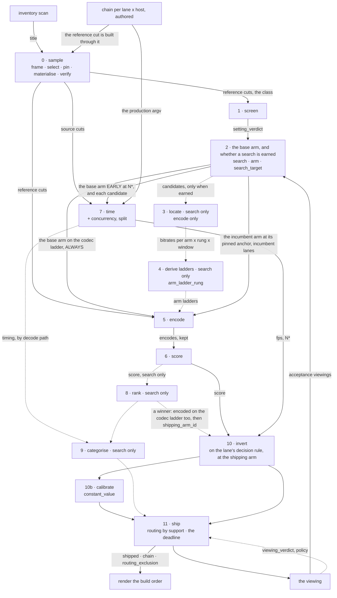

# The process: filling one cell of the lookup table

**What this is.** The procedure for producing **one column** of the iso-quality lookup table — one
`(content_class, encoder_unit, scoring_height)`, which is the measurement key of **I2**. *Not
`(content class × codec × card)`; that shorter form is incomplete, and I2 says why.*

> *An iso-quality lookup table: what settings on each card hit a fixed SSIMULACRA2 target, and what
> that costs in fps and bytes.*

**There are two deliverables, and the second one shapes what this procedure must record.** The
**build order** is one exact command per scenario, plus the bitrate logic that picks it. It consumes
the lookup table but does not have its shape: it wants **ONE value per `(lane, host, step)`**,
carrying a **provenance marker**, a **citation**, and membership of its **codec's ladder** — and it
may legitimately be `derived`, `no-content`, or a **policy decision that overrides the measurement**.
See `DATA-MODEL.md`.

**This document is the spec. It must be sufficient on its own** — if filling a cell needs anything
outside it, the spec is wrong and the fix goes here.

**How it is organised.** The invariants first: true on every card, before any procedure. Then two
practices that are not stages. Then **the stages, numbered as `DATA-MODEL.md` numbers them**, each
saying what it does, what it reads, what it writes, what is decided in it, what it refuses, and how
it couples to the others — because the couplings run backward as often as forward. The tables named
are the ones `sweep/schema.sql` defines. **Terms are defined once, in `DATA-MODEL.md`'s Terminology
table; the numbers a builder needs are in *The recipes*, at the end.**

---

## The invariants — true on every card, before any procedure

**I1 · THE LOOKUP TABLE IS A SET OF STANDALONE PER-CARD COLUMNS. IT IS NOT A COMPARISON.**
A cross-card number may be computed; it is not part of the deliverable. **The check is one line and
it is free: NAME THE CELL THE RUN FILLS BEFORE LAUNCHING IT.** A comparison has no cell to name.

**I2 · A SETTINGS VERDICT IS KEYED TO `(content_class, encoder_unit, scoring_height)`**, where
`encoder_unit = (vendor, card, driver, frontend, codec)`. **`(content class × codec)` — the form this
rule is usually quoted in — is INCOMPLETE**, and every component the longer key adds was measured to
matter: two frontends on one card differ by **−6.85% BD-rate**; `-compression_level` inverts sign
between vendors; a driver step moved bytes **14/14**. **HOST IS NOT IN IT** — a ladder is per codec,
not per node — **but host IS the shipping key**, and the two must not be merged. **`DATA-MODEL.md`
opens with the full argument.** The window set is not a sample to economise on — **it IS the content
class.**

**I2b · THE SCORING HEIGHT IS SET BY THE KIND OF CLAIM, AND IT IS A DECISION — NOT A DEFAULT.**
A **relative** claim (this rung beats that rung) survives a rescale: rung ranking flips 0–1 times in
60–270 pairs. An **absolute** claim — hits target t, clears a bar, sits above a floor — does not:
scores move 2.9–5.3 points and spans expand by a third, **worst encodes furthest**. An absolute
number quoted at a height nobody chose is unusable, and fixing it costs a re-encode as well as a
re-score, because the store holds scores and not encodes. **So: record the height AND why it was
chosen, per lane, before scoring anything** — which G1 makes a rule rather than a per-lane choice:
every lane scores at its device's panel height, `lane.score_height`.

**I3 · ADMISSIBILITY FIRST. A FAILURE EXCLUDES A CONFIGURATION; IT DOES NOT RANK IT.**
A mode that cannot be inverted is reported EXCLUDED, never "ranked last". A BD-rate over an
inadmissible arm is a number with no meaning.

**I4 · SIZE AND QUALITY ARE ONE CRITERION — that is what `bd_rate` is.** Scoring them separately
double-counts. Measure per window, then take a **MEDIAN**; a mean over windows has reversed a verdict.

**I5 · SPEED IS A SEPARATE CRITERION AND IT IS CHOSEN AFTER THE ISO-SCORE POINT.**
But measure it **EARLY** — see Stage 7.

**I6 · CAPABILITY AND SHIPPING ARE TWO TABLES.** State which question a table answers, in the table.

**I7 · AN ABSENCE IS NOT A NEGATIVE RESULT.** Check the probe ran and its output is non-empty before
reading meaning into it. **A probe that did not run and returns a POSITIVE is worse** — nothing looks
wrong. Failures here return **rc=0** routinely; **read stderr, never the exit status.**

**I8 · RESEARCH THE PARAMETERS; DO NOT REVERSE-ENGINEER THEM FROM BYTE COUNTS.**
What a flag selects is a question for the encoder's source: on one frontend `-global_quality` alone
selects ICQ rather than CQP, and its `-preset 1` is the *quality* end. Bytes at fixed quality
conflate rate and quality and cannot settle either.

**I9 · A CAVEAT THAT EXISTS FOR ONE ARTIFACT IS A BUG REPORT, NOT DOCUMENTATION.**
Warnings accumulate in three kinds, and only two of them belong in a doc:

    a property of the tools or the hardware that will recur   ->  document it
    an incident that could recur                              ->  make it a REFUSAL or a TEST
    a defect in ONE artifact                                  ->  FIX THE ARTIFACT, delete the note

**The third kind accumulates silently**, because deleting it requires someone to know the artifact
was fixed, and nothing tracks that — and a footnote about one file reads as a general problem for
everyone after. When a caveat is met, ask which of the three kinds it is **before** writing it down
again.

---

## Before the first encode — practices that are not stages

### Prerequisites — establish, do not assume

| | requirement |
|---|---|
| **sample** | the class's reference set: a REFERENCE cut per window (lossless, **through the production chain**) and a SOURCE cut (`-c copy`) — Stage 0. **Quality cells encode from the reference cut, so they measure the ENCODER** — the scalers and tonemappers never run in the scored path — while throughput runs from the source cut. **Two pipelines, two inputs.** |
| **chain** | the production filter graph per `(lane, host)`, **authored before the sample**: the reference cut is built through it, Stage 7 times it, and Stage 11 ships the same row |
| **rig parity** | the measurement container is built from **production's image**, so the driver and the userspace are production's; refuse on drift. A separate rig image drifting to a different driver package invalidates the whole dataset |
| **device** | address the card by **PCI slot**, never a render-node number |
| **unit identity** | a distinct `encoder_unit` per card in a multi-card box, or the cell keys collide with the other card's |
| **driver** | pinned and recorded on every row; **it is a FACTOR — part of the measurement key**, a column of `encoder_unit`. **A driver change is a new encoder unit, and the column starts again at Stage 1.** Probe the step before spending on it: one driver step moved bytes 14/14 and shifted the quality anchor, the next was inert |
| **the same harness on the node** | the artifact a plan was built for is the artifact the agent reports; refuse a node already running one |
| **quiet box** | no other active run on the machine during a timing run |

### Write BOTH empty tables first

**Table 1, the lookup column.** Write down before anything encodes: the **targets**, the **windows**
(the class from Stage 0), the **columns** (setting · Mbps · fps), and **which question it answers** —
capability or shipping. **Derive the targets from card-independent sources** — the metric's own
calibration, and this card's measured span. Reaching for another card's range is I1.
**In the model these are `search`, `search_target` and the arms — Stage 2 writes them.**

**Table 2, the build-order rows this lane will fill.** One per `(lane, host, step)`, and each needs
a **provenance marker**, a **citation**, and a **setting that is a rung on its codec's ladder**.
**Write the rows out empty, because they constrain the ladder too**: a shipping value that is not a
rung cannot be cited, and a ladder placed to invert the *capability* arm's targets will not invert the
*shipping* arm's. **A row may end up `derived`, `no-content` or `policy`** — legitimate outcomes, but
they must be *chosen*, not defaulted into because the ladder missed. **In the model these are the
`shipped` rows Stage 11 fills, and the shipping arm they will need is named in Stage 2.**

### A run is rows before it runs

The orchestrator writes the plan into the store before anything is launched: the `run`, the windows
it covers, and **every cell it will produce, with its settings**. The expected count is `count(cell)`,
never typed. A run has one stored `state` — planned · launched · running · complete · failed ·
abandoned — and an append-only `run_event` log that the waiter reads instead of a log file. A cell's
state is **derived** from its rows — planned, encoded, scored, timed, failed — so it cannot disagree
with them. A run is `complete` only once its product has been verified against the plan, and a run
marked complete with a cell still planned is refused. A failed cell carries its **stderr**, never the
exit status alone. A timing run refuses to share its machine; a run on a blocked host is refused with
the fix in the row; a run's unit must be in its host. **This is the whole "artifact must come home"
group of refusals, closed by construction.**

### A two-cell smoke pass through the whole chain

`encode → score → time → invert`, two cells, **~3 minutes of GPU**, before any stage runs at scale —
and **consume the output**, because a dry run finds none of it. Tool defects that leave a completed
measurement invisible — a product never fetched, a column missing so every row resolves to one arm,
an exclusion that holds only by accident — are found by reading what came back and by nothing else.

---

## The stages

**Each stage answers one question.** It reads named tables, writes named tables or nothing, makes
named decisions, refuses named things, and couples to the others. **Stages 0–2 fix the key** —
the class, the unit, the height. **Stages 3–7 measure. Stages 8–10 read and write nothing. Stage 10b calibrates.
Stage 11 decides.** The viewing sits before Stage 2 and beside the column; the render after it; the
probe outside it.

⚠⚠ **THE MANDATORY PATH, AND THE SEARCH.** Every column runs Stages 0, 1, 2, 5, 6, 7, 10, 10b and 11:
**the base arm on every rung of the codec ladder**, scored, timed, and inverted on the lane's rule —
about ninety cells and a few hours, and the only path a shipped value may come from. **Stages 3, 4, 8 and 9 are the search, and they run only when Stage 2 earned one**: a
screened setting that moved bytes beyond the noise floor on the class, with a mechanism worth
testing. The search is the exception, entered only where the screen pays for it.

**The backward couplings — what a stage must anticipate, and what it cost not to:**

| stage | must anticipate | because |
|---|---|---|
| **0 sample** | 11 ship | `measured` needs the lane represented in the class, and a class assembled for one lane can miss another lane's population entirely |
| **0 sample** | 8 rank | the frame's strata are what rank reads per stratum; a missing stratum cost 1.5–2.9 cq |
| **1 screen** | 10 invert | an anchor that is not MONOTONE cannot be inverted, so the mode is excluded here or never |
| **2 candidates** | 4, 7, 11 | the targets and the shipping arm are named here because 4's ladders must span them and 7 must time them |
| **2 candidates** | the viewing | a target, or the incumbent's acceptability, comes from the device; a search without one is refused |
| **2 candidates** | 7 time, 11 ship | the base arm is timed early, at N\*, because the shipping arm must clear the lane's throughput floor |
| **5 encode** | 11 ship | the base arm on every rung of the codec ladder, so any rung that ships was measured; a candidate that wins gets the same |
| **5 encode** | 10 invert | the incumbent arm at its pinned anchor on every member, so the bar the `incumbent` rule reads exists; the cell is the base arm's when the incumbent is the base's settings at a rung |
| **4 derive ladders** | 8, 10, 11 | overlap for `bd_rate`; span every target, else UNREACHABLE; include the codec rungs that could ship |
| **6 score** | the viewing | scoring deletes the encode; the viewing must re-encode and keep |
| **6 score** | 8, 10 | the height and the scorer build are in the key; changing either is a re-score AND a re-encode |
| **7 time** | 11 | N\* and the shipping preset come from here, so the shipping answer can be decided by the stage that runs last |

### Stage 0 · Sample — frame, select, pin, materialise, verify

**Does.** Builds the content class the whole column is measured on, and the files it is measured
from. Half of it is defined and half is judgement, and the frame keeps the two apart:

1. **Frame the population.** The class serves a set of lanes — one chain, one setting set (the kids
   `standard` pair; the M4 HEVC set). Take the union of their populations from the inventory.
   **The definable half is the technical spread, and it comes from the inventory:** stratify on
   **source resolution class** (native 1080p against 4K-downscaled was the distinction that
   mattered, not grain) · **dynamic range** (the tonemap runs or it does not) ·
   **source codec** (the decode path, for the speed criterion) · **source type** (WEB against REMUX
   — a WEB source is pre-compressed); and **spread on the continuous ones** — **bitrate, as bits per
   pixel so resolutions compare**, with a window near each quantile of what reaches the encoder, and
   fps, bit depth and field order wherever the population varies. Count every stratum; place every
   quantile. **The judgement half is the MIX** — which characters (dark and noisy, film grain, flat
   animation, CG, sustained motion, well-lit grain-free) and which titles carry them for this use
   case. Estimate the character shares and say so.
   ⚠ **`any` in `Coverage` is correct and it compresses the SAMPLE, not the lane.** The flow takes
   any width; the frame is where `any` is uncompressed, one stratum at a time. Do not add lanes to
   enumerate it — a lane that would ship the same value twice is not two lanes.
2. **Allocate.** Every non-empty stratum and every quantile gets at least one window; that is the
   structural check. Beyond one, allocate in proportion to the stratum's share of **what reaches
   the encoder** — for a lane with a skip rule, what survives it; otherwise the population —
   because the class-level median weights strata by their window count. Six to eight windows has
   been the working size; the frame, not the number, says whether it is enough.
3. **Pick the title per stratum** for the stress it carries hardest — the darkest, the grainiest,
   the most motion. That is judgement, and it is written on the window as its `character`. A title
   that could fill two strata is counted for one, named.
4. **Select the window inside the title**, deterministically: fixed length; it must span a scene cut,
   so lookahead and adaptive I-placement are exercised; the most demanding such segment by the
   selection score. **The tool proposes; the operator PINS `ss`, and a pinned window is never
   re-scanned** — its content hash is in every cell key.
5. **Materialise.** The reference cut is the title's lane chain minus the encoder — decoded, scaled,
   tonemapped, stored lossless; for a passthrough lane, decode alone. The source cut is the window
   `-c copy`. **Built once, on one host; every card encodes the same pixels**, and the content hash
   is of decoded frames, checked equal on every node before anything is scored.
6. **Verify.** A cut carries what its source carries — a content check, not a checksum, because a
   faithful copy of a broken cut passes every sha. A cut whose source is gone is classified with a
   reason or refused.
7. **Record the frame** with the class: strata and quantiles, counts, the windows per stratum and
   where each sits in the spread, every gap with its reason.

**Reads.** `title` (the inventory scan, dated) · `lane`, `lane_step` (which lanes the class serves,
their predicates) · `chain` (the served lane's chain on the materialising host — the reference cut is
built through it, so it is authored before the sample) · the operator's mix.
**Writes.** `window` · `content_class` · `content_class_lane` · `content_class_stratum` ·
`content_class_member` (FILES — authored) · `reference_set` · `cut` (materialise) · `cut_check`
(verify).
**Decides.** Which lanes the class serves; the strata and their minimums; the mix; the pinned `ss`.
**Refuses.** A non-empty inventory stratum or quantile with no window · a member with no reference
cut · a class serving no lane · a reference cut built with an unserved lane's chain · a cut whose
content differs from its source · a lane marked has-content whose population is empty.
**Couples.** Forward: every cell key carries the reference cut's content hash, so **a re-cut is a
re-run of everything after it**; the class is the key's content half; the strata are what Stage 8
reads per stratum; the served lanes decide whether Stage 11 may write `measured`. Backward: it needs
the lane table (Coverage) and the inventory, and nothing else — it is the only stage with no
measurement before it.

### Stage 1 · Screen — which modes are admissible, and which settings the unit honours

**Does.** Two things, both on real content of the class, and both before any search exists.

**(a) The admissibility tests**, each a refusal recorded with the base it was taken under:
1. **Does the encoder open in the mode this lane ships?** Verbatim stderr, not rc. An encoder that cannot open in a mode fails
   every cell that uses it — hundreds at a time in a locate pass.
2. **Which rate-control mode is actually selected?** On QSV it is **implicit** — `-q:v` → CQP,
   `-global_quality` alone → **ICQ**, `-b:v`+`-maxrate` → CBR, `-b:v` alone → VBR. Read the source.
3. **Is the quality anchor MONOTONE?** ⚠⚠ **Sweep at STEP 1 ON THE BINDING WINDOW**, ≥3 repeats.
   A step-4 sweep on an easy window walks straight over a reversal and reports "monotone".
   **A curve that doubles back cannot be inverted, so this is Stage 10's precondition, tested here.**
4. **Does the card decode the codec?** One frame, per codec, read stderr. ⚠ **Counting decoded frames
   is a FALSE PASS** — software fallback produces frames too. **The answer is `decode_path` on every
   timing row, not a capability table** — the model refuses to hold one.
5. **What is the quality range?** An encoder's range can end short of the ladder — one AV1
   frontend ends at **51**. A target past the encoder's range is
   `UNREACHABLE` — an admissibility property, **not a missing measurement**.
6. **Does it obey a rate request, where the lane has a cap?** *`ran` is not `usable`.*

**(b) The setting screen.** Each candidate flag injected over a **measured** base, at the ladder
midpoint, three repeats (V1); magnitude read against a noise floor of five identical encodes.
- ⚠ **A prerequisite must be one the card is MEASURED to honour.** A plausible-but-unverified base
  manufactures a second artefact wearing the appearance of a met precondition. A base that cannot
  open the encoder gives **`BASE_FAILED`**, never `REJECTED`.
- ⚠ **A single-flag screen cannot see an option whose precondition is unmet** — it reads INERT,
  indistinguishable from a card that ignores it.
- ⚠⚠ **HONOURED needs one window; INERT needs the class.** A screen on one window can find what a
  card honours; it cannot exclude anything — inert on one clip is not inert. Only the INERT
  candidates need the remaining windows (`DATA-MODEL.md`, THE SAMPLE, rule 2).
- ⚠⚠ **DO NOT CARRY A SCREEN MAGNITUDE INTO A LANE CONCLUSION.** The screen runs at the ladder
  midpoint, which may be far outside the lane's operating range. One flag can carry three different
  magnitudes, each correct at its own operating point.
- ⚠ **Speed verdicts from the screen are not reproducible** — 12 of 15 flipped across six screens on
  an idle box while **0 of 15** size verdicts did. The per-setting spread and the noise floor are the
  same magnitude. **Speed is Stage 7's.**

**Reads.** `setting`, `setting_scope`, `setting_enum_value` (what to screen, the defaults) · the
reference cuts · the encoder unit, driver pinned.
**Writes.** `encode` (discarded) · `cell_failure` · `setting_verdict` — **per window** — ·
`setting_verdict_cell`. The orchestrator wrote the plan first: `run` (stage `screen`), `run_window`,
`cell`, `cell_setting`. The unit-level reading is
**derived**, `v_setting_unit_reading`: HONOURED if any member moved, INERT only if every member was
screened and none did, otherwise *"incomplete, k of n"*.
**Decides.** The base each setting is screened under (measured HONOURED, or the verdict is refused);
the operating point; the admissible mode — which is the **anchor** Stages 3–5 place ladders on.
**Refuses.** A verdict under a base not measured HONOURED on that window · INERT from fewer than all
members · a synthetic source (`testsrc2` produced a published, retracted 10.33%) · the screen's own
speed verdicts as evidence.
**Couples.** Forward: Stage 2's survivor set; the anchor and mode for 3 and 5; **monotonicity for
10**; the quality range, which is where a target becomes UNREACHABLE on the deliverable (t=75 on 5
of 6 windows). Backward: only Stage 0.

### Stage 2 · The base arm, and whether a search is earned

**Does.** Writes the search — the class, the unit, the anchor, the height — and its **base arm**: the
admissible mode from Stage 1, stock defaults, the encoder's default preset (B1). **That arm on every rung of the
codec ladder is the mandatory path**, and for most units it is the whole path. Then it decides
**whether a search is earned**: a screened setting that moved bytes beyond the noise floor on the
class, with a mechanism worth testing, becomes a **candidate arm**; nothing else does. When there are
candidates: block **by subsystem** (rate control · frame types · tiles · plumbing); treat `-preset` as
an **ordinal ladder to sweep, not a factor to cross**; then by survivor count, **k ≤ 4** full
factorial · **5–8** resolution-IV fractional · **k > 8** Plackett-Burman; a block that is wholly
inadmissible is **excluded with a written reason**. ⚠ **The tile arms were a hypothesis the search
tested, not a guess at the answer** — an arm may be there to be refuted. A full cross is `2^17`, and
each candidate is a whole RD curve, which is why nothing enters without the screen's evidence.

**Reads.** `v_setting_unit_reading` (the survivors) · `setting.subsystem` (the blocks) · the lane
(its `decision_rule`, its steps, its panel height) · **the viewing, as a required input**: for a
`target` lane the acceptance viewings its targets come from; for an `incumbent` lane the acceptance
viewing that found what ships today acceptable on the device.
**Writes.** `search` (the class, the unit, the **anchor**, the **height**) · `arm` · `arm_setting`
· `search_target`. FILES, authored — **the intent, which is why they are not rows.**
**Decides.** The base arm (`arm.role = base`, exactly one), which is the shipping arm until a
candidate beats it (`search.shipping_arm_id`); whether a search is earned, and which candidates
(`role = candidate`); the targets (I1: never another card's range); the height (I2b: before anything
is scored); the coarse ladder Stage 3 encodes when there is a search, `search_coarse_rung`.
**For an `incumbent` lane, the incumbent arm** (`role = incumbent`) — the settings that ship today,
pinned at the anchor value that ships (`arm.anchor_value`), which Stage 10 reads as the bar — naming the acceptance viewing that accepted it
(`arm.accepted_by_viewing`). **For a `target` lane, the targets**, each naming the acceptance viewing
it came from (`search_target.viewing_id`), never another card.
**Refuses.** An arm using a setting not measured HONOURED on the unit on some member of the class ·
an inadmissible mode · more than one anchor · an `incumbent` lane's search without exactly one
incumbent arm · a `target` lane's search without targets · an incumbent arm no acceptance viewing
found acceptable · a target that names no acceptance viewing for the lane · an incumbent arm whose
viewing judged a different configuration · a search without exactly one base arm · an incumbent arm with no pinned anchor · a shipping arm
that belongs to another search.
**Couples.** Forward: Stage 5 encodes the base arm on the whole codec ladder, always; Stages 3, 4, 8
and 9 exist only for the candidates named here; **7 times the base arm early, at N\***, and each
candidate; 4's ladders must span the targets; 10 inverts at the shipping arm. Backward: **this is where "write both tables first" happens** — the
targets, the columns and the shipping row are decided here because the ladder stage cannot satisfy
a criterion nobody wrote down.

### Stage 3 · Locate — where each arm's bitrate lands (search only)

**Does.** **Runs only when Stage 2 wrote candidate arms.** Encodes every arm at **one coarse anchor ladder shared by all** — the only place a shared
ladder is correct — over the whole class, **encode only, never scored**. Its product is a bitrate
map. Arms are not comparable at the same quantiser: a frame-type flag measured **0.47–0.60x** the
bitrate of its default at the same quantiser, so a shared ladder puts arms in near-disjoint bitrate
ranges and scoring the coarse cells directly leaves every window below `bd_rate`'s four-point floor.

**Reads.** `search`, `arm`, `arm_setting` · `search_coarse_rung` · the reference cuts.
**Writes.** `encode` (bitrate; the file discarded) · `cell_failure`. The plan — `run` (stage
`locate`), `run_window`, `cell`, `cell_setting` — was rows before launch.
**Decides.** Nothing — the coarse ladder was authored in Stage 2.
**Refuses.** An arm whose bitrate span does not intersect the others' · a cell whose identity settings
match no arm · a locate cell whose anchor value is off the coarse ladder · a run covering a window
outside its class.
**Couples.** Forward: Stage 4 entirely. Backward to 2: admissibility failures at scale — the 126 QVBR
cells — send the arm set back to Stage 2, which is cheaper than finding out at Stage 5.

### Stage 4 · Derive ladders — one ladder per (arm, window), against every criterion at once (search only)

**Does.** **Runs only when Stage 2 wrote candidate arms.** From the locate bitrates, places each arm's rungs on the range **all arms share**, per
window, and checks the placement against **every consumer before Stage 5 spends the GPU**:

| criterion | needed by |
|---|---|
| ≥4 rungs inside the range the arms SHARE | Stage 8, `bd_rate` |
| span EVERY target | Stage 10, else `UNREACHABLE` |
| span the targets **at the shipping arm** | Stage 11's shipping table |
| include the codec ladder's rungs | *not this ladder's job* — Stage 5 encodes the shipping arm on the whole codec ladder |
| overlap the incumbent | *(not a requirement — the drift, I1)* |

⚠⚠ **OVERLAPPING FOR BD-RATE AND SPANNING THE TARGETS ARE DIFFERENT REQUIREMENTS.** They do not
conflict — **one wider ladder satisfies all of them.** Derive it from all criteria before encoding.

**Reads.** The locate `encode` rows with their `cell_setting` · `search_target` · `ladder_rung` (the
codec's rungs) · the arms.
**Writes.** `arm_ladder_rung` — rows carrying the locate run that produced them. ⚠ **Never into the
search spec**: machine output written into a hand-authored file leaves nothing that says which parts
a person chose and which a tool computed.
**Decides.** Nothing by hand. The floor of four is a constant of the method.
**Refuses.** Fewer than four rungs for an `(arm, window)` · a ladder derived from a run that is not
the locate run of the same search.
**Couples.** Forward: 5 (the rungs), 8 (the shared range), 10 (the span), 11 (the rungs that can
ship). **Backward: the most coupled stage in the process.** It must satisfy three later stages at
once, and a ladder placed for one of them is repaired only by encoding more cells.

### Stage 5 · Encode — the base arm on the codec ladder, always; the search's arms when earned

**Does.** Always: **the base arm on every rung of the codec ladder, on every member of the class**,
from the reference cut — about ninety cells, a few hours — so that every rung the build order might
ship is measured. When a search was earned: every candidate on its arm ladder as well, and a
candidate that later wins gets the codec ladder too. **For an `incumbent` lane, the incumbent arm at
its pinned anchor on every member** — cells that already exist when the incumbent's settings are the
base arm's and its anchor is a rung, one cell per member otherwise — so the bar Stage 10 reads was
measured on this class and this unit. **Keeps the encode until it is scored.** The
expected cell count is derived from the plan, never typed. The node's harness is proven the same
harness by sha on both ends before launch.

**Reads.** `ladder_rung` for the base arm · `arm_ladder_rung` for the candidates · `arm_setting` · the
incumbent arm's `anchor_value` · the reference cuts · `search`.
**Writes.** `encode` (kept) · `cell_failure`. The plan — `run` (stage `encode`), `run_window`, `cell`,
`cell_setting` — was rows before launch, so the expected count is `count(cell)`.
**Decides.** Nothing. A plan derived from the search.
**Refuses.** A busy node · a harness sha that differs · a cell on a window the run did not declare ·
a run covering a window outside its class · a value outside the setting's enumeration · a cell
whose identity settings match no arm · a rung of the codec ladder the shipping arm never encoded on
some member, checked before Stage 10 reads it · an incumbent arm with no scored cell at its anchor on
some member.
**Couples.** Forward: 6. Backward: 4's rungs; and **a class edited between Stage 3 and Stage 5
changes coverage** — which is why the run declares its windows in `run_window` and the verdict says
*k of n*.

### Stage 6 · Score — the metrics, at the decided height

**Does.** Rescales reference and encode **identically** to the search's height (the transform must
be the same on both sides), runs SSIMULACRA2 and butteraugli through FFVship and one libvmaf pass
for vmaf, cambi, psnr and float-ssim; records `mean`, `p5` and `min`; writes the scores; **then
deletes the encode**, because the store holds scores, not encodes.

**Reads.** `cell` and its kept `encode` · the reference cut, content hash checked · `search.score_height`
· the scorer build and metric backend, which are in the key.
**Writes.** `score` (cell × height × metric × statistic) · `step_trace` · `encode.kept = 0`.
**Decides.** Nothing. The height was decided in Stage 2; the metric set is fixed and none is
dropped — `libvmaf` is 47% of the scoring CPU and exists to produce numbers Stage 8 must at least
report.
**Refuses.** A scorer build without the named filter · a reference whose content hash differs · a
height the search did not declare · a score with no height (the DDL).
**Couples.** Forward: 8 and 10 read these numbers; **the viewing cannot** — the encodes are gone, so the
viewing re-encodes its pairs and keeps them. Backward: **decide the yardstick before scoring**. The
height, the statistic and the metric backend are in the cell key; changing any of them is a
re-score, and since the encodes are deleted, a re-encode.

### Stage 7 · Time — the chain's throughput, measured early

**Does.** Repeated whole-window timings of the **production chain** — decode, filters, encode — on
the **source cut**, per arm; the first sample flagged warm-up and kept; the noise floor measured per
run; **the decode path measured per window**; N\* by workers (concurrency); the regime by truncated
legs (split). ⚠⚠ **SPEED CAN BE THE DECISIVE CRITERION**: a preset step measured
**+66.3% fps for +1.42% BD-rate** — 35x the effect for the price — and it decided what shipped. Two
arms timed at Stage 2's time give that answer. I5 says speed is chosen after the iso-score point; it
does not say measure it last.

**Reads.** The source cuts · `chain(lane, host)` — the production argv, authored before the sample and the same row Stage 11 ships
· the arms to time: the base and the shipping arm at least · workers.
**Writes.** `encode` (discarded) · `cell_failure` · `timing` (workers × repeat × leg, `decode_path`,
`is_warmup`, the floor). The plan — `run` (stage `time`, `concurrency` or `split`), `run_window`,
`cell` (source cut), `cell_setting` — was rows before launch.
**Decides.** Which arms to time, and N\*.
**Refuses.** Averaging across decode paths · a delta smaller than the measured spread · a screen speed
verdict as evidence · a timing run on the reference cut · reading a missing timing as "unchanged" —
it is **UNMEASURED**.
**Couples.** Forward: 9 (speed, within a decode path); 11 (`workers` = N\*, and the shipping preset);
the regime statements, which are never carried across chains — the `av1_qsv` chain's encoder share
is roughly double the `av1_vaapi` one's. Backward: **must run before Stage 8 finishes**, because it
decides the shipping arm that Stage 4 had to span. ⚠ **Never exclude a window from the speed
criterion; PARTITION by measured decode path.** A software-decode window is CPU-bound where the
others are GPU-bound and one N\* cannot describe both — so it is reported beside the hardware
windows, never averaged in and never dropped, and it stays in the efficiency ranking regardless
(`DATA-MODEL.md`, THE SAMPLE, rule 3).

### Stage 8 · Rank — efficiency per arm (search only)

**Does.** **Runs only when a search was earned; with one arm there is nothing to rank.** Per window, the BD-rate of each arm against the base **over the bitrate range they
share**, under **every metric and every statistic**; refuse a window whose overlap is below the
floor; then a **MEDIAN** across windows, with the range and *k of n* stated; and the same reading
**per stratum**, because a stratum that disagrees with the others is a finding.

**THE RULE:**
1. **SSIMULACRA2 ranks. Nothing else ranks.**
2. **Compare arms by BD-rate over a shared bitrate range — never rung-for-rung.** ⚠⚠ Arms at the
   same quantiser are NOT at the same bitrate: `uhq` spends **6.98 Mbps where no-tune spends 11.79**,
   and `-b_strategy 1` runs at **0.47–0.60x**. A same-`cq` comparison measures who spent more bits.
3. **Compute the BD-rate under EVERY metric and report them all.** It is free — the numbers are
   already in the row — and it is the only way a dissent becomes visible.
4. **A metric that INVERTS is a finding that needs a decision, never a tiebreak to average away.**
5. **Report `mean`, `p5` and `min` always — they agree on the WINNER and disagree on the SIZE OF
   THE WIN.** Measured over one committed search, mean and p5 agree on sign in **9 of 9** arm
   pairs, but the magnitude differs by up to **2.7x** (+40.54% against +111.19%), so which one is
   quoted changes how strong a case looks.
   ⚠⚠ **AND WHEN A DECISION MATCHES *ON* A STATISTIC RATHER THAN RANKING BY IT, THE ANSWER CAN
   INVERT** — one measured pair costs **+11% size** matched on the mean and **saves 7.4%** matched on
   p5. **Same data, opposite sign, decided by an unjustified statistic.**
6. **PSNR and SSIM never rank.** On this content they track SSIMU2 closely, so they add nothing; on
   the question they were tested against — denoised versus grain-kept — they ranked **opposite to the
   eye**. ⚠ `ssim` is additionally saturated: **tied on 76% of arm pairs**.

**What the metrics actually do, computed over one committed search — BD-rate of a tune arm against
its no-tune base, 6 windows:**

    ssimulacra2   -3.71%      butteraugli  -10.47%      vmaf   -32.97%
    ssimu2_p5     -9.65%      psnr_y       -10.08%      cambi  +61.07%   <-- INVERTS

⚠ **VMAF is not redundant and not a tiebreak.** It agrees on the winner and disagrees on strength by
9x, because it is **saturated** — ±1 point across a comparison where SSIMU2 moves ±7.
⚠⚠ **CAMBI is the only genuine dissent, and it is consistent: 36 of 36 pairs worse**, median absolute
delta **+0.385** on a 0.02–2.55 range, largest on smooth content and smallest on grain. Within one arm's ladder every metric agrees with SSIMU2 (0–5%
discordant pairs); across arms, direction usually agrees and magnitude spans 9x.

**Reads.** `score` · `encode` (bitrate) · `cell_setting` and `arm` (which cell is which arm) ·
`arm_ladder_rung` (the shared range) · `content_class_member`, `content_class_stratum` (n, and the
strata).
**Writes.** **NOTHING.** A rendered table. A stored aggregate is indistinguishable from a
measurement a month later.
**Decides.** Nothing itself. The operator reads it and sets `search.shipping_arm_id`: a candidate
that beats the base by more than the floor on efficiency **and** clears the lane's throughput floor
becomes the shipping arm, and is then encoded on the codec ladder too, so the rung it ships is
measured; otherwise the base ships. Where CAMBI dissents, it reports; the decision is the viewing's
and Stage 11's.
**Refuses.** Rung-for-rung · a mean over windows · an inadmissible arm in the ranking · an
`(arm, window)` below the four-point floor — refused and reported, so the median's *k of n* is
visible · matching *on* a statistic instead of ranking by it.
**Couples.** Forward: 9, 10 (the winning arm), 11. Backward: 4's shared range; 0's strata and n; 6's
every metric.

### Stage 9 · Categorise — EFFICIENCY · SPEED · BOTH · NEITHER (search only)

**Does.** **Runs only when a search was earned.** Per setting, arm against base: **efficiency** from Stage 8's median BD-rate; **speed** from
Stage 7 within a decode path, read against that run's own measured spread. ⚠ **The labels carry no
direction: read the sign.** An arm reads EFFICIENCY because that criterion *moved* — by +43.73%,
catastrophically worse. **The category is an OUTPUT of the sweep, never an input**: measured, an
HEVC preset step is efficiency rather than speed, and `-compression_level` is a size lever on one
vendor and a speed lever on another.
**Reads.** Stage 8's reading, recomputed · `timing`, partitioned by `decode_path`.
**Writes.** **NOTHING.**
**Refuses.** A missing timing read as unchanged — **UNMEASURED** · a delta inside the spread.
**Couples.** Forward: Stage 11 — settings that move efficiency set the iso-score operating point;
settings that move speed only are chosen afterwards, for the shipping config.

### Stage 10 · Invert — the lookup column, on the lane's decision rule

**Does.** Reads the lane's `decision_rule` and inverts on **whichever constraint binds**, per window,
at the shipping arm (`search.shipping_arm_id` — the base, unless a candidate beat it), and at the
best-quality candidate for the capability table when one was searched — always from **the tightest
straddling pair, never extrapolated**:

- **`cap`** — the best-quality rung whose bitrate keeps the window under the ceiling — `CEILING`
  itself, through the lane's cap constant; no headroom is applied to a window — **the worst window
  deciding**. The score it lands at is reported, not targeted. A window still over the ceiling at
  `BOUND` is the unfixable tail; in production such a title goes to `bitrate-target-encode` and lands
  over budget at `BOUND`. This is the rule a capped lane uses.
- **`incumbent`** — per window, the incumbent arm's score at its pinned anchor, at the panel, is the
  bar — Stage 5 encoded it on every member; the candidate's
  anchor is the one whose score crosses it, and the candidate wins only if it does so for fewer
  bits. A relative claim, which survives a rescale. This is the rule a lane with an incumbent uses.
- **`target`** — the anchor where the chosen statistic crosses the target from `search_target`;
  **UNREACHABLE** where the ladder does not straddle it. The target comes from the viewing, never
  from another card.

For every rule: the Mbps at the point, the fps from Stage 7, and whether the Mbps clears the cap.
Two tables, each saying which question it answers (I6): **capability** at the best arm — the
fixed-target read that makes cards comparable at equal quality — and **shipping** at the shipping
arm under the lane's rule.
**Reads.** `lane.decision_rule` · `score` at the search's height · `encode` (bitrate) · `search_target`
· the incumbent arm's cells at `arm.anchor_value` · `arm_ladder_rung` · `timing` · `v_constant_current` through the lane's
cap.
**Writes.** **NOTHING.** The column, rendered.
**Refuses.** Extrapolation · a non-monotone anchor · mixed heights · a target past the encoder's
range — UNREACHABLE is an admissibility fact from Stage 1, not a missing measurement · a rule the
search cannot serve — an `incumbent` lane without an incumbent arm, a `target` lane without targets ·
an incumbent arm unscored on a member.
**Couples.** Forward: 11. Backward: 1 (monotone anchor), 2 (the rule's inputs, the height), 4 (the
span), 7 (fps), 10b (the cap's constants).

### Stage 10b · Calibrate — the constants the flow's per-title logic consumes

**Does.** Produces every constant the build order's bitrate logic runs on, each with its provenance,
**and runs none of that logic** — the five rules are applied per title, in the flow, at transcode
time; the harness only supplies their numbers. A `measured` constant is computed from rows it names
and refuses a typed number; a `policy` constant is chosen, and carries its reason and what bounds it;
a `derived` one carries its inputs and its precision.

| constant | what it is | provenance | from |
|---|---|---|---|
| **`CEILING`** | the device budget as a bitrate cap | `derived` | the user's *512 GB / ~50 h*, with its inputs and ±~10% |
| **`MARGIN`** | the remux **skip threshold**: the saving the probe's encode must show over the source rate of the same windows before encoding beats a remux | `policy` | bounded below by the probe's own precision — under ~0.15 the skip call sits inside the noise for half the titles |
| **`HEADROOM`** | the fraction of `CEILING` requested as `-b:v` in `bitrate-target-encode` so a **whole title** lands under the cap | `measured` | **the one full-length encode**: a library title through the production chain at the requested rate, and the ratio it delivers. A window cannot answer this: a factor guessed from windows overshoots, and one such guess exceeded the cap on 15 of 15 windows |
| **`RUNG_FACTOR`** | the bitrate ratio between adjacent rungs of the codec ladder | `measured` | the median over windows, from the base arm's scored ladder |
| **`BOUND`** | the worst-quality rung `bitrate-target-encode` may fall to while chasing the cap; a title still over the cap there stays over budget at `BOUND` | `measured` | the population probe: per-title rates at the shipping anchor, projected to worse rungs by `RUNG_FACTOR` and capped at `CEILING`; `BOUND` is the smallest such rung at which the lane's **weighted mean** comes under `CEILING`. The viewing may then confirm it on the class's hardest window and override as policy |
| **`HOST_THRESHOLD`** | the source rate below which a `>1080p` title is remuxed rather than encoded | `measured` | the population probe's results on the lane's titles |

⚠ **`MARGIN` and `HEADROOM` are not one constant:** one is a skip test against the *source*, the
other a request against the *ceiling*, and only the second needs the full-length encode.
⚠ **`BOUND` is a budget computation over the population, not a quality floor on the class's worst
window.**
**Reads.** The base arm's `encode` rows on the codec ladder · `score` at the lane's height · the
population probe's per-title rates · the full-length encode (`cut_kind = library`) · `lane`,
`constant_scope`.
**Writes.** `run` (stage `calibrate`) · `constant_value` — the value, and the run it came from.
**Decides.** Nothing by hand. A constant whose provenance is `measured` has no typed value in the
model at all; `v_constant_current` reads the latest calibrated one. A `policy` value is typed, with
its reason.
**Refuses.** A measured constant with no calibrated value · a measured constant with a typed value ·
a policy constant with no reason · a derived constant without its inputs and precision (all DDL).
**Couples.** Forward: Stage 10's `cap` rule reads `CEILING` through the lane; Stage 11's
`bitrate-target-encode` rows read `HEADROOM` and `BOUND`; the build order's per-title logic reads all
six. Backward: it needs Stage 6's scored ladder, the population probe and the full-length encode —
the two places the process reads whole titles, both to produce a number and never to route one.

### Stage 11 · Ship — one value per (lane, host, step)

**Does.** Chooses the value per `(lane, host, step)` from Stage 10, the `workers` from Stage 7's N\*,
and the production chain per `(lane, host)`; records **provenance** (`measured` · `derived` ·
`no-content`), **who decided** (`measurement` · `policy`) and the reason; applies the constants Stage
10b calibrated that admit the lane — `bitrate-target-encode`'s rate request is CEILING × HEADROOM and its bound is BOUND,
and the row says so. ⚠ **A shipped anchor is a rung of its codec's ladder, and it was measured.** ⚠⚠ **Capability and
shipping are two tables, and a shipping judgement is never baked into a capability column.**
**Routes by support.** Every host with a unit whose codec is the lane's (`host_unit`) gets a row for
every step of the lane, or a `routing_exclusion` with a reason: a unit that supports a lane is routed —
support is a hardware fact, and a policy reason for not routing is written as an exclusion.
**Reads the deadline.** Content
minutes per wall minute per `(lane, host)` at the shipped setting and N\*, from Stage 7's timing over
the class, against the lane's floor — `lane.min_content_rate`, per lane, because lanes
tolerate different conversion speeds. A row under the floor is refused; a floor with no
timing behind it is **UNMEASURED, not unchanged**; a lane with no floor is reported and never refused.
**Reads.** Stage 10's tables · 9 · 7 (N\*, the timing) · `host_unit` · `chain` (authored) · `ladder_rung` · `constant`,
`constant_scope` ·
`lane_step` · `content_class_lane` and `v_class_lane_representation` · `viewing_verdict` ·
`v_constant_current` · policy.
**Writes.** `shipped` · `shipped_setting` · `routing_exclusion`. *(`chain` is authored input; Stage 11
reads it and ships the same row.)*
**Decides.** The policy overrides — the kids worker counts sit below what throughput alone would
pick; media-01's `qp 15` is a budget interpolation confirmed by eye — each with `decided_by =
policy` and a reason. A `no-content` row still carries settings so the flow has no hole.
**Refuses.** An anchor that is not a rung · `measured` without the lane's population represented in
the evidence class · `measured` on a class not sampled for the lane · a constant outside its scope
· an encode step with no chain on that host · a step the lane does not have · a `measured`
configuration no cell matches, setting for setting · a unit that is not in that host · a supported
lane with a step neither routed nor excluded with a reason · routed and excluded at once · a row
under the lane's throughput floor, or with no timing behind it · a remux row that is not `fixed`.
**Couples.** Forward: the build order is rendered from these rows; the viewing views these values.
Backward: 0 (representation), 4 (the rungs that were measured), 7 (N\* and the shipping arm). ⚠⚠ **And
nothing crosses to another lane.** A carry is a `derived` row with a reason, and the join makes it
look different from a measurement.

### After the column · Render the build order

**Does.** Generates the build order's per-scenario commands from `shipped` × `chain` ×
`lane` × `lane_step` × `host`, with the provenance and citations from the rows. The case set is a
join, not a file: every `(lane, host, step)` in Coverage × hosts has a `shipped` row or an exclusion
with a reason, and the generator's assertions check the generated command rather than a hand-written
one.
**Reads.** The decision tables, `lane`, `host`.
**Writes.** The document — a rendering, like `DATA-MODEL.md`'s schema blocks.
**Couples.** Consumes Stage 11 only. Replaces by construction the doc checks a hand-written build order and a
hand-written case set need to keep them agreeing.

### Before Stage 2, and beside the column · The viewing

**Does.** A person judges encodes on the device, blind. Two kinds of verdict. **A pair**: the shipped
value against a neighbour on a class window — a, b, same, unsure. **An acceptance**: one encode,
for one lane's use — acceptable, not acceptable, unsure — because acceptability belongs to the use,
not the picture: the kids watch in daylight, the daylight-brightness rule came from here, and the
metrics argue against it. The encodes are re-encoded from the reference cut and **kept**. It is the
one measurement whose instrument is eyes, and it runs **first**: for an `incumbent` lane the
acceptance that says what ships today is acceptable is what Stage 2's incumbent arm names; for a
`target` lane the acceptance a target comes from is what each target names. It is also what
calibrates a metric: **a metric can become a veto only once someone has established what delta is
visible on this content and this device.**
**Reads.** Reference-path encodes, kept · the device · the lane the judgement is for.
**Writes.** `viewing_verdict` — a person's verdict, a FILE.
**Refuses.** A verdict on an encode that was discarded · an acceptance with no lane · a pair with
one encode.
**Couples.** Forward: Stage 2 — a required input for `incumbent` and `target` lanes, and a search
without it is refused; Stage 11 (a policy override with a reason); Stage 8's rule 4 (what an
inverting metric means). Backward: Stage 6 deleted the encodes, so the viewing encodes its own.

### Outside the column · The pre-pass probe

**Does.** In production, per **title**: the HEVC probe at a pinned anchor that decides `remux`,
`quality-target-encode` or `bitrate-target-encode`, against `HOST_THRESHOLD` and the cap. Its unit
is a title, not a class, so it never touches the sample. In the harness it runs over the lane's population only, as Stage
10b's input for `BOUND` and `HOST_THRESHOLD`; the full-length encode that fixes `HEADROOM` is Stage 10b's too.
**Reads.** The library file · `v_constant_current`.
**Writes.** `run` (stage `probe`, no class) · `cell` (`cut_kind = library`, a generated window) ·
`encode`.
**Couples.** Stage 10b, and nothing in the column.

---

## The recipes — the numbers a builder needs

**A stage is not a spec until its numbers are written down.** Each recipe below names its source:
an **established** method, the **incumbent** recipe that produced the committed values (kept, because
changing it changes every value), or a **convention** chosen here and labelled as such. A recipe has a
name, and a row that depends on one carries the name — a score carries `recipe = S1` — so a changed
recipe is a new name and a re-run, never a silent drift.

### G1 · Geometry — where every score is read

The device panel is `W × H`. A source of `w × h` is shown **width-limited** when `w/h ≥ W/H`:
`(W, round(W·h/w))`; otherwise height-limited: `(round(H·w/h), H)`. **Both dimensions are forced
even**, because yuv420 needs them so. 16:9 on the M4's 2752×2064 is **2752×1548**; 16:9 on the 10.5"
iPad Pro's 2224×1668 is **2224×1250** — the raw quotient is 1251, and the even rule makes it 1250.
`lane.score_height` is that height. *Incumbent rule; the display-resolution principle is Netflix's
VMAF practice.*

### S1 · Scoring — reproduces the committed values

1. **Rescale both operands with the same software scaler, never a hardware one:**
   `ffmpeg -max_frame_delay 16 -i <operand> -vf scale=w=W:h=H -c:v ffvhuff -pred plane -pix_fmt yuv420p10le`.
   The scaler is ffmpeg's default bicubic; it is immaterial as long as both sides share it, and a
   different scaler is recipe S2 and a full re-score. `-pred plane` and `-max_frame_delay 16` are
   speed levers measured framemd5-identical. Hardware **decode** is admissible (framemd5-identical)
   and not adopted; hardware **scaling** is not admissible. The reference is rescaled once per
   `(cut, geometry)` and cached; the encode once per cell.
2. **FFVship**, two passes: `--source <ref> --encoded <enc> -m SSIMULACRA2 --json` and
   `-m Butteraugli`; threads at their default (raising `-t` slows it; the scores are bit-identical
   either way). FFVship writes per-frame values and no aggregate; **the pooling is ours**: `mean`,
   `min`, `max`, `p5`, `p95`, where a percentile is **nearest rank, `ceil(p·n) − 1` into the ascending
   list** — never floor, never `round(p·(n−1))`. The retired fork floored it and read one frame off
   for every cell. Butteraugli is pooled per norm (qnorm, 3norm, infnorm); the campaign reads
   `infnorm max`.
3. **libvmaf, one pass, four numbers:** input 0 is the DISTORTED encode, input 1 the REFERENCE —
   swapped they silently produce a wrong number. `libvmaf=feature=name=cambi|name=psnr|name=float_ssim:log_fmt=json:n_threads=<2 × cpu_count>`;
   with CUDA, both legs `format=yuv420p10le,hwupload_cuda` under `-init_hw_device cuda=cu
   -filter_hw_device cu` and the `libvmaf_cuda` filter — **10-bit in**, because an 8-bit conversion
   moved CAMBI by 42%. Pooled `mean` of vmaf, cambi, psnr_y, float_ssim; harmonic means recorded where
   present. The thread count is a speed lever measured bit-identical from 0 to 32.
4. **Stored:** `ssimulacra2` mean · p5 · min; `butteraugli` max (infnorm); `vmaf`, `cambi`, `psnr_y`,
   `float_ssim` mean; each row with `height`, `recipe = S1` and `scorer_build` (FFVship version, ffmpeg
   build sha). **Deterministic:** FFVship is bit-deterministic on one GPU and libvmaf across thread
   counts, both measured, so the acceptance bar of "the same" is exact.

*Incumbent recipe, lifted from the old scorer so it survives the archive; the only best-practice
content in it is "same transform on both sides, at display resolution, named on the row".*

### K1 · The cell key

`sha256` of the canonical JSON — keys sorted, separators `,` and `:` — of: `encoder_unit_id` ·
`cut.content_sha` · `cut_kind` · `window_id` · the identity settings as a sorted list of
`[setting_id, value]` · the ffmpeg **version string**. The first 32 hex characters. **Excluded on
purpose:** the ffmpeg build sha and the driver runtime (recorded on `run`, not identity — a rebuild
was measured byte-identical), the host (not a factor), and `computed` or `default_resolved` settings.
The unit's driver is inside `encoder_unit_id`, so a driver change is a new key. ⚠ **These key strings do not equal the archived
harness's**; the acceptance comparison matches on `(window, identity settings, height, metric,
statistic, recipe)`, never on the key. *Incumbent decisions on what is excluded; canonical-JSON
hashing is the ordinary way to content-address.*

### W1 · Window selection

Length **per class, recorded on the window (`window.t`)** — 60 s in every reference set so far. Scan
the title at 1 Hz for mean saturation (`signalstats`) and per-frame scene-cut
scores (`scdet`). A candidate window **must contain at least one cut with score > 10** — a hard
requirement, so lookahead and adaptive I-placement are exercised. Score =
`mean saturation × (1 + 0.1 × min(cuts, 10))`; take the maximum; uniform spacing, no randomness;
then **pin `ss`**. *Incumbent policy, kept because a different policy is a different class. The
established alternative is SI/TI (ITU-T P.910) to place windows across the complexity plane; recorded,
not adopted.*

### F1 · The frame's spread

Continuous strata: **bits per pixel at p10, p50 and p90** of what reaches the encoder — the median
and both tails, at least one window in each band. Categorical strata: source resolution class
(`≤ 1920` / `> 1920`), dynamic range (sdr / hdr), source codec, source type. **`source_type` is a
filename heuristic**: `REMUX` → remux; `BluRay`, `Blu-ray`, `BDRip` → bluray; `WEB-DL`, `WEBRip`,
`WEB`, `AMZN`, `NF`, `DSNP`, `HMAX`, `ATVP` → web; else other — recorded on `title` and correctable
by hand. *Three quantiles are a convention; stratified sampling with a frame is the established
method.*

### V1 · The screen's verdict

The base is encoded **five times**; `floor_bytes = (max − min) / median` of the bytes, and the same
for speed, which is reported only. Each setting value is injected over the base at the anchor's
ladder midpoint, **encoded three times, and its bytes are the median of the three** — one encode
suffices when the base's five were byte-identical. **HONOURED** when `|bytes − base| / base > 2 × floor_bytes` and the difference is
not zero; **INERT** when the difference is within the floor — byte-identical, when the floor is zero;
**PARTIAL** when some values are refused by the encoder (stderr) and others accepted, with which
recorded; **REJECTED** when every value is refused; **BASE_FAILED** when the base cannot open;
**EXCLUDED** only with a reason. Magnitude is the largest relative byte delta across values. The
unit-level reading is derived (`DATA-MODEL.md`). *The 2× margin is a convention in the spirit of a
two-sigma rule, and three-with-median is a convention — the incumbent encoded each value three times
and kept the LAST size, indefensible where bytes vary between identical encodes; the verdict
vocabulary is incumbent.*

### T1 · Timing, the spread, and N\*

**Five repeats per cell, the first discarded as warm-up and kept flagged.** The timed cut's length is
the cut's own, recorded on it; the archived campaign timed 30 s cuts. Median by nearest rank;
`spread = (max − min) / median` of the four kept. Concurrency: sweep `N = 1, 2, 3, 4 …` until the
aggregate stops rising; the aggregate is **total frames over batch wall**. **N\* is the smallest N
within the noise band of the best, not the argmax** — the plateau is flat and the risk asymmetric.
Two N\* inside each other's spread are *not resolvable at this precision*, and the doc says so.
*Incumbent rule; warm-up plus repeats is what SPEC and MLPerf require.*

### R1 · The rank floor

A candidate beats the base when its **median BD-rate across windows is better by more than
`max(1.0%, BD floor)`**, where the BD floor is the BD-rate of the base against its own repeat encodes
— zero for a byte-deterministic encoder. Ranked under every metric, decided on SSIMULACRA2. *1% is
the conventional level below which codec evaluations treat a BD-rate delta as noise; a convention.*

### B1 · The base arm on a fresh unit

The admissible constant-quality mode from Stage 1, **every other setting at the encoder's default,
and the encoder's default preset** — nvenc `p4`, qsv `4`, vaapi's default `compression_level`. The
preset ladder's two ends, best-quality and fastest, are **standing candidates**, because the deadline
trade cannot be read without them: preset is swept, not crossed. *Evaluating from vendor defaults is
standard; which ends to sweep is judgement.*

### E1 · Rendering a command

For a shipped row: the chain from `chain.vf_template`; then the settings — mode selectors first, the
anchor next, the rest by `setting_id` — each as `setting.flag value`, booleans as `1` / `0`, a
`computed` value with a comment naming its constant; the container, audio and subtitle policy from
`lane`. A generated command is asserted by the scenario's `must_contain` / `must_not_contain`, which
now test the generator. *Convention.*

### P1 · The viewing

Blind; each pair in random A/B order; the same window and time range; the device's native player;
brightness set for the lane's use — daylight for the kids lanes. A **pair** is the shipped value
against its neighbour rung; an **acceptance** is one encode played against the source cut on the
device. At least one window per bpp band and the class's hardest window. **One viewer is the
protocol's accepted limit, and the verdict records who.** *A deliberately reduced paired comparison
in the family of ITU-R BT.500 and ITU-T P.910.*

### H1 · The throughput floors

`lane.min_content_rate`, content minutes per wall minute, per lane. **The user's numbers; NULL until
set, and until then reported, never refused.**

⚠ **Honest labelling.** S1, K1, W1, T1 and the verdict vocabulary of V1 are the incumbent recipes,
kept so the committed values can be reproduced and so a changed recipe is visible as a new name. G1's
principle, F1's method, T1's warm-up and P1's family are established. The 2× and the three-with-median in V1, the 1% in R1,
the three quantiles in F1, the preset ends in B1 and the grammar in E1 are conventions chosen here.

## The refusals that must survive into any new harness

**→ `refusals.json` is the inventory. It is the checklist the new harness's tests are written
against, and it is machine-readable so coverage can be asserted rather than remembered. The checks
the model already enforces are rendered at the end of `DATA-MODEL.md`.**

**The invariants, in six groups**, collapsed from the refusal-shaped sites of the archived harness;
many of those sites enforced one invariant between them.

| group | what it protects |
|---|---|
| `identity_and_provenance` | the record names what actually ran |
| `admissibility` | a configuration is excluded, not ranked |
| `measurement_validity` | the number means what it says |
| `the_artifact_must_come_home` | a finished measurement is not lost or indistinguishable |
| `orchestration` | the invocation exists afterwards, and reaches the right machine |
| `the_search` | the ladder and the ranking answer the question asked |

⚠ **The selection rule, so the list stays honest:** ordinary validation — a missing file, a bad
argument — is **not** in it, because a new harness grows that naturally. **Everything in the
inventory exists because something silently produced a wrong answer once**, and those do not grow
back. Each entry carries the incident that bought it.

⚠ **An entry with no test in the new suite is an invariant that has been dropped**, whether or not
anyone meant to drop it. That is the whole reason it is a file and not a paragraph.
